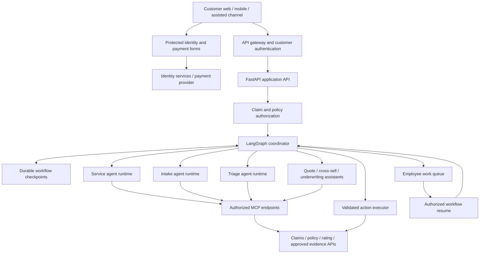
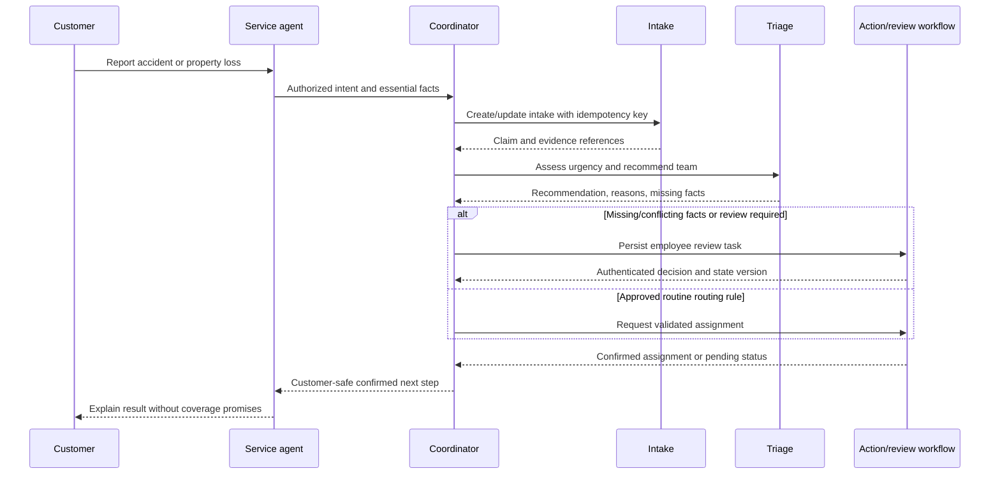

# Insurance Agentic AI Platform — Architecture

Model selection for the POC is governed by [ADR 0001](adr/0001_model_selection_and_provider_abstraction.md): start with GPT-5.4 mini through an OpenAI adapter and revisit the model using quality, latency, and cost evidence. Integration remains planned.

**Status:** Proposed reference architecture; no infrastructure deployed.  
**Scope:** Enterprise insurance across vehicle and property lines.  
**Planning scale:** Approximately 20 million vehicle policies and 20 million property policies in force.  
**Updated:** September 12, 2026.

This architecture describes a hypothetical enterprise insurance platform. Portfolio figures are design assumptions, not reported company results, customer counts, or validated infrastructure capacity. For planning, vehicle and property volumes are interpreted as policies in force; insured vehicles, locations, and unique households require separate counts.

Companion documents: [Strategy](STRATEGY.md) defines outcomes, scope, and rollout; [Deployment topology](DEPLOYMENT_TOPOLOGY.md) defines cloud placement, isolation, Terraform, and operations. Cloud product capabilities are cited; architecture choices are recommendations.

The [Phase 1 implementation guide](PHASE_1_IMPLEMENTATION_GUIDE.md) defines the initial AWS implementation with LangGraph: service, intake, and human-reviewed triage, starting with auto. Its smaller deployment profile groups these roles in one graph runtime with a separately controlled action service. Fraud analysis and other cloud implementations are deferred.

## Key architecture decisions

1. Maintain one repository with shared domain contracts, LangGraph workflows, prompts, and evaluations.
2. Deploy a complete, independent stack to each selected cloud. Deploying AWS must not require Azure or GCP credentials, infrastructure, Terraform state, or runtime availability.
3. Use Amazon Bedrock AgentCore Runtime on AWS, Microsoft Foundry Agent Service hosted agents on Azure, and Gemini Enterprise Agent Platform Agent Runtime on GCP.
4. Use Terraform for infrastructure. Keep cloud modules and state separate; do not attempt one universal module that hides incompatible cloud semantics.
5. Use FastAPI for the application-facing API. Adapt invocation to each managed agent runtime's documented contract.
6. Keep the coordinator's LangGraph state authoritative for orchestration. Remote specialist agents exchange scoped task and result objects; they do not share a Python dictionary across services.
7. Isolate agent tools through server-enforced authorization and workload identities, with separate runtimes for production roles that require stronger separation.
8. Keep raw identity and payment data out of ordinary model context and shared state. Agents work with authorized references and minimized results.
9. Begin with service, intake, and triage recommendations. Add consequential actions only through explicit policy, validation, and approval controls.

Independent cloud deployment does not imply automated cross-cloud failover. Each deployment needs approved connectivity to its insurance systems of record. Those existing systems may remain shared enterprise dependencies; the AI stacks do not automatically replicate them.

## Business capabilities and authority

| Role | Responsibility | Initial authority boundary |
|---|---|---|
| Customer service | Understand intent, retrieve authorized status, explain confirmed next steps | No cancellation, coverage determination, or payment authority |
| Coordinator | Route tasks, manage workflow state, deadlines, and handoffs | Deterministic policy controls action permissions |
| Claims intake | Capture structured facts and evidence references | Create/update intake through validated, idempotent APIs |
| Claims triage | Recommend urgency and handling team | No denial, settlement, or definitive fraud accusation |
| Cross-sell | Identify relevant optional auto/property opportunities | No unsolicited sales insertion into loss assistance; no binding |
| Quote | Call approved rating engines and explain eligible offers | No LLM-generated premiums or invented discounts |
| Underwriting assistant | Assemble evidence, check rules, identify exceptions | Human review for adverse or exceptional decisions initially |
| Fraud support | Gather evidence and explain anomaly indicators | Referral to investigators; indicators are not proof |
| Coverage/settlement support | Assemble policy evidence and assessment material | Authorized decision maker retains consequential authority |
| Billing | Explain authorized payment status and initiate protected payment collection | No full card data in model context |

Risk depends on permitted actions rather than an agent's name. Intake is generally a safer first use case than autonomous underwriting; triage can still cause harm through incorrect prioritization. Human reviewers must be able to inspect evidence and override recommendations.

### Customer journeys

- **Prospect:** Gradual collection of necessary information → quote → eligibility/underwriting checks → customer review → protected payment → authorized bind → onboarding.
- **Existing customer:** Authenticate → authorize relationship access → confirm current information → service, claim, or new coverage workflow.
- **Existing auto customer adding property:** Reuse authorized relationship data, collect property facts, perform new property underwriting, calculate approved bundle impact, and link policies after acceptance.
- **Loss reporting:** Address immediate needs first. Cross-sell is not a mandatory step in claims assistance.

## Logical architecture

The following is deployed independently inside each cloud boundary.



The shared MCP box represents a logical tool layer with role-specific permissions, not one unrestricted tool collection. Authentication at the edge is followed by object-level authorization at every private lookup or action.

### Two deployment profiles

| Profile | Structure | Implication |
|---|---|---|
| Local development | One FastAPI process with service/triage nodes and mock tools | Simple shared state; Python tool lists provide logical separation only |
| Enterprise target | Coordinator plus separately deployed specialist runtimes and MCP services | Distinct identities, permissions, scaling, and release boundaries |

The deployment requirement is independence **per cloud**. Separate deployment **per agent** is an additional recommended production control, especially for underwriting, billing, and fraud roles. Low-risk roles may be grouped if their common permission boundary is acceptable.

## FastAPI and managed runtime contracts

FastAPI exposes a stable customer application contract. It can run on a conventional application container service in the same cloud and call the managed agent runtime through a cloud-specific adapter. Agent implementations may themselves use FastAPI where the managed runtime contract supports it.

An application route such as `/claims/triage` must be adapted to the selected managed runtime contract. Runtime entrypoints, health checks, authentication, session identifiers, streaming, supported image architectures, and invocation envelopes must be implemented and tested per cloud.

Proposed application endpoints:

| Endpoint | Behavior |
|---|---|
| `POST /v1/conversations` | Creates a customer-scoped conversation |
| `POST /v1/conversations/{id}/messages` | Validates access, accepts a turn, starts/resumes the graph |
| `GET /v1/tasks/{id}` | Returns authorized task status and customer-safe results |
| `POST /v1/reviews/{id}/decision` | Accepts an authenticated employee decision with evidence/version checks |

Use short synchronous responses for quick requests and durable queued execution with `202 Accepted` plus task status for long work. Streaming is optional. A dropped connection must not repeat a claim creation or payment attempt.

## Cloud deployment boundary

The complete cloud mapping, runtime adapters, environment separation, and regional recovery design are maintained in [Deployment topology](DEPLOYMENT_TOPOLOGY.md). Each cloud can operate independently; shared enterprise systems remain explicit dependencies.

## Shared state and agent communication

LangGraph nodes read workflow state and return updates. In one process, this is shared graph state; in distributed deployment, the coordinator owns durable state and merges validated specialist results. [LangGraph Graph API](https://docs.langchain.com/oss/python/langgraph/graph-api)

Example state shape, with synthetic identifiers:

```json
{
  "schema_version": "1.0",
  "conversation_ref": "conv-demo-01",
  "workflow_version": "claims-intake-v1",
  "claim_ref": "claim-demo-123",
  "line_of_business": "auto",
  "intent": "report_loss",
  "evidence_refs": ["evidence-demo-01"],
  "task_status": "awaiting_review",
  "triage": {
    "priority": "urgent",
    "recommended_team": "vehicle_damage",
    "reason_codes": ["VEHICLE_NOT_DRIVABLE"]
  },
  "pending_action_ref": "action-demo-01",
  "state_version": 4
}
```

Identifiers are still sensitive linkable data. Minimize and protect them. Authentication credentials and delegated tokens stay in trusted runtime/request context, never in the state object or model-generated fields. Any cached authorization metadata must be revalidated before an action.

Task envelopes carry `task_id`, `correlation_id`, `schema_version`, `claim_ref`, allowed evidence references, requested operation, deadline, and idempotency key. Identity and permission scope are bound by the authenticated transport, not trusted from an arbitrary task body. Results carry status, validated output, evidence references, reason codes, and model/prompt/rule versions.

Use a single writer or optimistic concurrency per workflow. A trusted conversation-to-customer mapping controls checkpoint access; a user-supplied conversation identifier is not sufficient. Keep full specialist transcripts local to the specialist when retention is justified; return only required results to the coordinator. Apply retention and deletion rules to checkpoints and backups as well as chat records.

### A2A versus APIs versus MCP

- **LangGraph:** Owns application orchestration and state transitions.
- **Internal APIs/cloud invocation adapters:** Default transport to known specialist deployments.
- **MCP:** Exposes authorized tools and data operations to an agent.
- **A2A:** Optional standard for delegated tasks between independently built agent systems. Adopt when interoperability creates value; deployment to separate clouds does not itself require cross-cloud agent calls. [A2A documentation](https://a2a-protocol.org/)

Do not enable arbitrary public agent discovery. Register and approve specialist endpoints through deployment configuration.

## MCP tool isolation

| Agent identity | Example permitted tools | Excluded by backend policy |
|---|---|---|
| Service | `get_claim_status`, `get_policy_summary` | Raw identity vault access, settlement, cancellation |
| Intake | `create_claim_intake`, `attach_evidence_reference` | Coverage denial, payment authorization |
| Triage | `get_triage_facts`, `get_routing_guidelines` | Payment, underwriting changes |
| Cross-sell | `get_bundle_eligibility`, `request_quote` | Fraud investigation files, payment credentials |
| Underwriting support | `get_authorized_risk_facts`, `check_eligibility_rules` | Unreviewed adverse decisions or arbitrary pricing changes |

Enforce four boundaries:

1. **Model tool list:** Bind only explicitly allowed tools to each agent.
2. **Workload identity:** Give each deployed role its own credentials and least-privilege invocation rights.
3. **Server authorization:** Verify agent role, customer/employee authority, claim/policy ownership, purpose, and allowed fields for each tool call.
4. **Runtime/network:** Separate execution and control egress where required; do not load all agent secrets into a shared process and call it strong isolation.

A shared MCP server is acceptable if it enforces these policies per identity. Separate endpoints alone do not enforce authorization. Use short-lived workload/delegated credentials, validate issuer and audience, and avoid blindly forwarding customer access tokens to downstream servers.

Tool responses and retrieved documents are untrusted inputs. Validate schemas, constrain tool arguments and destinations, restrict outbound access, and treat text that attempts to change instructions as content rather than authority. Redaction and model guardrails are additional controls, not substitutes for authorization.

## Sensitive information and customer trust

| Data | Protected processing path | Ordinary agent exposure |
|---|---|---|
| Driver license | Protected upload/identity or driving-record service | Reference and verified result; no full image/number |
| SSN | Collect only for a necessary permitted purpose through a protected form | Completion status/reference |
| Payment card | Payment provider hosted fields or protected voice keypad flow | Tokenized payment reference, status, masked display when needed |
| Exact address | Policy/property/rating service with scoped access | Property reference and relevant results; exact address only when justified |
| Date of birth | Identity/rating service | Age or verification result when sufficient |
| Claim photos/documents | Access-controlled evidence store and authorized extraction | Minimized facts and evidence references; approved images only when needed |

These are proposed minimization defaults. Do not claim an AI has never seen sensitive information if attachments, transcription, or a specialist model actually processes it. Card security codes must not be retained after authorization, even encrypted. [PCI Security Standards Council](https://www.pcisecuritystandards.org/faqs/1319/)

Protected forms send data directly to approved processing services. Prevent raw data from entering chat where feasible; detect accidental pastes before model dispatch, redact without echoing, and cover application logs, recordings, tracing, error reports, and analytics. Detection is imperfect, so minimize collection and access at the source.

Disclose AI involvement, explain why each sensitive field is requested, offer an employee or conventional form path, and preserve completed work during handoff. Customer acceptance is required before purchase or an authorized coverage/payment change. Employee approval and customer acceptance are separate events.

Verify provider retention, training-use, support-access, region, and deletion terms per service and configuration. No-training settings do not automatically imply zero retention. Keep production data out of development fixtures and CI. Region policy must cover model endpoints, managed logs, evidence stores, backups, and any cross-region inference routing.

## Claims workflow and human review

The sequence below illustrates the broader target. Phase one adds urgency screening before intake completion and repeats it as facts change; urgent employee handoffs must not wait for a claim receipt. All phase-one triage recommendations require employee review, including routine routing. See the [phase-one workflow](PHASE_1_IMPLEMENTATION_GUIDE.md#2-workflow-and-agent-responsibilities).



Auto example: an undrivable vehicle warrants evaluation for expedited handling; reported injuries follow an approved injury process. Property example: an uninhabitable home follows an urgent path for immediate-needs review without promising accommodation coverage.

Safety-critical needs use explicit escalation rules rather than waiting for unconstrained LLM reasoning. Unknown facts are not interpreted as negative answers. Fraud anomalies route to investigators with evidence and do not automatically block assistance.

Persist human review tasks with responsible team, due time, evidence, proposed action, and state version. Resume only after an authorized decision; revalidate stale facts and permissions. Record rejection, amendment, and override reasons. The model cannot grant itself approval.

## Reliability, observability, and evaluation

### Reliability controls

- Bound LLM tool loops, total tokens, execution time, tool timeouts, and per-customer request rates.
- Retry transient failures with backoff; do not retry authorization failures as if they were transient.
- Use operation-level idempotency and deduplication for claim creation, assignment, and payments. Do not assume exactly-once message delivery.
- Persist work before acknowledging long-running tasks. Route exhausted retries to a monitored queue and employee fallback.
- Support catastrophe bursts with quotas, queue prioritization, backpressure, and tested scaling behavior.
- Keep regional recovery within the selected cloud by default. Set RTO/RPO with business owners and prove checkpoint/evidence restore in recovery exercises.

### Telemetry

Propagate correlation IDs across API, graph, runtime, and MCP calls. Record versions, latency, token/cost usage, tool result codes, action status, review outcomes, and policy decisions. Log approved reason codes and evidence references rather than hidden chain-of-thought or full prompts by default. Sanitize sensitive values before export. Maintain a restricted action audit trail separately from debugging traces.

### Required evaluation cases

| Area | Representative cases |
|---|---|
| Access isolation | Another customer's claim ID, forged conversation ID, wrong role/tool, expired token |
| Prompt injection | Instructions embedded in estimates, property reports, tool responses, and customer text |
| Claims quality | Missing injury status, undrivable vehicle, uninhabitable home, conflicting evidence |
| Correct communication | No invented coverage, discounts, payment promises, or assignment confirmation |
| Reliability | MCP timeout, model throttling, duplicate request, restart during human review, stale approval |
| Privacy | Accidental SSN/card paste, license image, DOB/address leakage in logs and outputs |
| Portability | Equivalent contract behavior and quality thresholds across cloud/model configurations |

Measure cost per resolved request, intake completion, triage agreement and overrides, urgent-case misses, claim cycle time, handoff completion, privacy incidents, and quote/bundle conversion where applicable. Break results down by line of business, claim complexity, and deployment. Compare against matched baselines; adjust for catastrophe activity and customer mix. Distinguish released capacity from realized expense savings and avoid double-counting benefits.

## Delivery strategy

Delivery phases, business measures, ownership, and portfolio assumptions are maintained in [Strategy](STRATEGY.md). Deployment readiness and recovery criteria are maintained in [Deployment topology](DEPLOYMENT_TOPOLOGY.md).

## Acceptance checklist

- Each cloud can be provisioned and operated without another cloud's deployment or credentials.
- Service, intake, triage, and response flows work for synthetic auto and property cases.
- Separate role identities cannot invoke prohibited tools or retrieve unrelated customer records.
- Raw payment/identity data is collected through protected paths, with verified logging and retention behavior.
- The coordinator persists workflow state and correctly resumes reviewed work after restart.
- Action execution is validated, idempotent, and auditable; customer-facing status reflects confirmed system state.
- Every selected cloud passes its own deployment, runtime, security, and quality checks.
- The repository contains reproducible instructions and documented SDK/CLI exceptions to Terraform ownership.

The resulting platform shares business logic and governance while letting each cloud own its deployment, identity, data boundary, and operational lifecycle.


