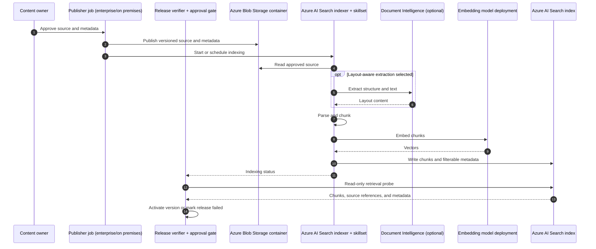
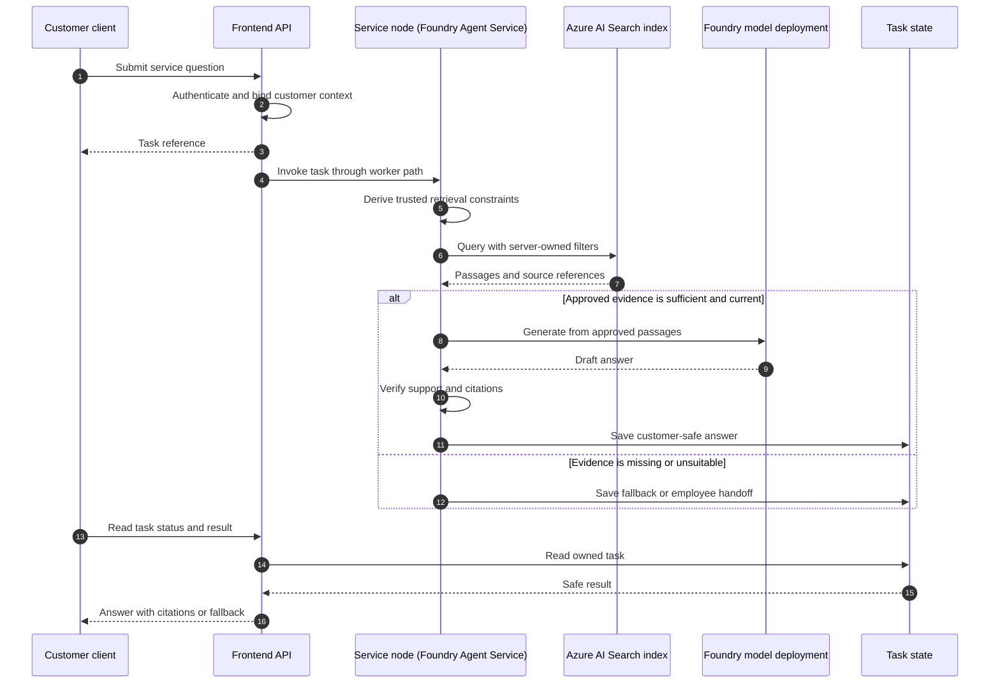

# Azure RAG deployment topology

**Status:** Proposed later-cloud design. No Azure RAG service, embedding deployment, Terraform root, ingestion job, or live retrieval adapter exists in this repository.
**Updated:** September 18, 2026.

This document sketches an independent Azure implementation of the bounded customer-service knowledge corpus. AWS remains the phase-one deployment target. The [platform deployment topology](DEPLOYMENT_TOPOLOGY.md) owns shared runtime, network, release, and recovery boundaries; the [Phase 1 guide](PHASE_1_IMPLEMENTATION_GUIDE.md#phase-one-rag) defines answer behavior and evaluation criteria. The [AWS RAG topology](AWS_RAG_Deployment_topology.md) records the separate, more developed AWS design. Azure service choices below require a deployment spike before adoption.

## Proposed placement and ownership

| Component | Underlying resource / placement | Boundary |
|---|---|---|
| Approved publisher | Enterprise content workflow or job; may run on premises or in an approved application environment | Approves versions and writes source blobs and metadata; does not create embeddings or write Search index documents |
| Release verifier and approval gate | Application release job and state store; may share the publisher's environment | Queries Search after indexing to verify source and citation metadata, then activates the approved version; has query access, not index-write access |
| Approved source documents | Private, versioned container in an Azure Storage account (Blob Storage) | Publisher writes only approved material; Search reads through its data source connection |
| Data source, indexer, and skillset | Objects configured and run inside an Azure AI Search service | The blob indexer reads source changes and runs parsing, chunking, and embedding skills; it is not a separate Azure resource or application job |
| Document extraction | Azure AI Search built-in document parsing and Text Split skill; optionally the Document Layout skill, which calls Azure Document Intelligence in Foundry Tools | Select layout-aware extraction for complex PDFs, tables, or images after testing quality, region, and billing requirements |
| Embeddings | Approved model deployment, for example an Azure OpenAI embedding deployment accessed through the Search skillset | Record model, dimension, and chunking version; select and validate the endpoint during the Azure spike |
| Retrieval index | Index inside the Azure AI Search service, with vector and filterable source metadata | Separate per environment; choose audience isolation after authorization tests |
| Retrieval caller | LangGraph service node hosted in Microsoft Foundry Agent Service | Agent managed identity gets query access to the selected Search service; the application owns authorization filters |
| Answer generation | Approved Foundry model deployment called through the configured generation adapter | Retrieved passages are context, not authority to call tools |
| Customer evidence | Separate protected container or account in Azure Blob Storage | Never indexed into the shared knowledge corpus |
| Workflow state | Application database and LangGraph checkpoint store, proposed Azure Database for PostgreSQL | Never used as the knowledge index |

[Azure AI Search integrated vectorization](https://learn.microsoft.com/en-us/azure/search/vector-search-integrated-vectorization) supports an indexer pipeline for source reading, chunking, embedding, and indexing. A **search indexer** is the Search service's scheduled or manually run ingestion worker: its data source points to Blob Storage, its skillset describes transformations, and its output goes to a Search index. The index, indexer, data source, and skillset are distinct objects within the same Azure AI Search service. [Document Layout](https://learn.microsoft.com/en-us/azure/search/cognitive-search-skill-document-intelligence-layout) calls Document Intelligence when selected; it may need an attached billable Microsoft Foundry resource. A dedicated Document Intelligence extraction service is another design option if the Search skill does not meet document-quality needs. This is a candidate mapping, not a claim that the selected model, region, index schema, network mode, or Terraform provider support has been verified. Keep Azure resources and credentials independent of the AWS stack.

## Publish and ingest

The publisher records a stable document ID, source version, line of business, intended audience, jurisdiction when relevant, approval status, and effective dates in a governed release manifest. Only approved material enters the Blob source container. The index schema must preserve these fields on every retrievable chunk, including a source reference suitable for customer citations. Search fields used for policy filters must be configured as filterable; the ingestion spike must prove that index projections retain the required metadata after chunking. [Azure AI Search filter documentation](https://learn.microsoft.com/en-us/azure/search/search-filters)

The publisher does not convert documents to vectors or push chunks into the index. The Search indexer reads Blob content, invokes the embedding model through its skillset, and writes the resulting chunks and vectors. A separate release verifier issues read-only queries against the Search service after indexing to check that the expected source version, citation reference, and access metadata can actually be retrieved. That query is a release check, not an indexing step or citation-generation call.

Publishing a blob does not make its content eligible for answers. Release automation must wait for indexing and retrieval probes, then activate the verified source version in an application approval gate. The publisher and verifier may be implemented in one release system, but their permissions should remain distinct. If release continuity requires keeping an older index available during rebuild, test a versioned-index and alias switch design before relying on it. The manifest, gate, and release automation are proposed integrations.

## Customer retrieval and access

The customer calls only the application API. It authenticates the customer and binds server-owned context before the service node submits a search request. The service derives audience, line-of-business, jurisdiction, approval, and effective-version constraints from trusted context. User text and model output cannot expand those constraints. Choose and test whether an application-controlled filter, separate indexes, or Azure AI Search document-level access controls best enforces audience separation; search-service RBAC by itself does not express the full business authorization policy. [Vector query filters](https://learn.microsoft.com/en-us/azure/search/vector-search-filters) and [document-level access options](https://learn.microsoft.com/en-us/azure/search/search-document-level-access-overview) have distinct behavior that must be validated against the selected schema and identity model.

The diagram abbreviates the durable outbox and worker path in the [platform topology](DEPLOYMENT_TOPOLOGY.md#async-request-and-response-path). Live policy and claim facts continue to come from authorized enterprise APIs. Treat retrieved text as untrusted content, validate citations against the approved release, and keep raw queries and passages out of unrestricted logs.

## Withdrawal and recovery

On revocation, immediately block the source version in the application approval gate. Then remove or replace the source and run the indexer or explicitly delete indexed chunks. Verify that the withdrawn version is absent from eligible results before clearing the incident. Blob deletion alone does not prove that Search has removed indexed content: [Azure AI Search deletion detection](https://learn.microsoft.com/en-us/azure/search/search-how-to-index-azure-blob-changed-deleted) has timing and configuration requirements. A failed indexing or verification step leaves the version blocked.

For recovery, restore the approved source set and release manifest, rebuild or restore the Search index in the selected region, and run source, citation, filter, withdrawal, and missing-evidence probes before resuming customer RAG. Reindex and re-evaluate whenever the embedding model, vector dimension, chunking, or index schema changes. Restored workflow checkpoints do not establish that the retrieval index is current.

## Identity, observability, and release gates

- Use separate publisher, indexer, verifier, and runtime identities. Grant the publisher limited source writes, the indexer source reads and embedding/indexing permissions, and the verifier and runtime query access. Validate exact Azure RBAC assignments and any private connectivity in the chosen region.
- Isolate development, staging, and production corpora, indexes, identities, and indexing jobs. Promote approved content deliberately and verify each environment independently.
- Record source version, indexing outcome, retrieval latency, empty-result rate, citation failures, denied-filter probes, and stale-index alerts without logging sensitive full passages or customer queries.
- Before a pilot, prove approved-source retrieval, irrelevant-source rejection, customer versus employee access, effective dates, withdrawal, citation accuracy, missing-evidence fallback, latency, and restore behavior with live Azure resources.

## Decisions before implementation

1. Select the Azure region, Search tier, embedding deployment, vector dimension, chunking settings, and capacity from a measured corpus and query workload. Compare built-in parsing with Document Intelligence layout extraction on representative documents, and confirm the required Foundry resource, region, and cost if layout extraction is selected.
2. Validate the exact Blob-to-Search indexing pipeline, source metadata projection, filters, deletion behavior, and release-switch procedure.
3. Decide the audience isolation mechanism and prove deny cases under the real application identity and customer authorization model.
4. Confirm managed identity, network connectivity, Terraform/provider coverage, operational ownership, cost, and recovery objectives in an Azure development spike.

These decisions do not affect the AWS phase-one pilot or imply that Azure is already deployed.
