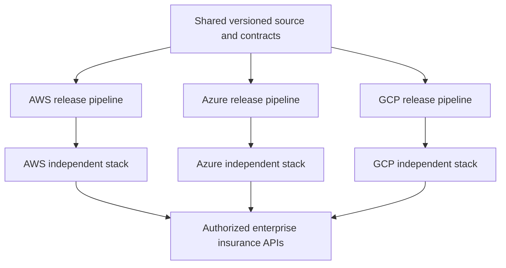
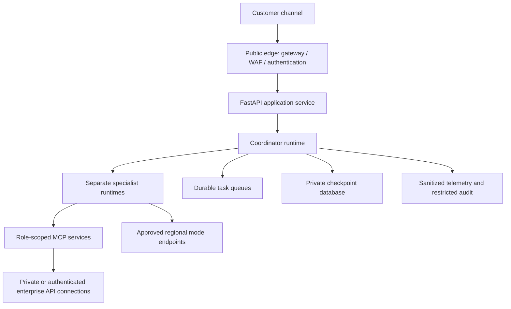

# Insurance Agentic AI Platform — Deployment Topology

**Status:** Proposed deployment design; no infrastructure deployed.  
**Updated:** September 12, 2026.  
**Repository:** `insurance-agentic-ai-platform`

This document owns physical deployment boundaries, cloud service selection, Terraform structure, release management, and recovery. See [Architecture](ARCHITECTURE.md) for agent behavior and trust boundaries and [Strategy](STRATEGY.md) for business priorities and scale assumptions.

For the first release, follow the [Phase 1 implementation guide](PHASE_1_IMPLEMENTATION_GUIDE.md): deploy service, intake, and human-reviewed triage using LangGraph on AWS, with one graph runtime and a separately controlled action service. The multi-cloud and specialist-per-runtime diagrams below describe broader targets, not prerequisites for the first pilot.

## Independent cloud stacks

The platform targets an enterprise portfolio of approximately 20 million vehicle policies and 20 million property policies in force. This is one portfolio planning envelope, not 40 million policies per cloud or a requirement to replicate all customer records into three clouds. Actual routing and data ownership must be configured for the selected deployment.

Each cloud is a separately deployable implementation of the same contracts. An organization may use one implementation or allocate defined workloads to multiple implementations. No application request requires another cloud's agent runtime, checkpoint store, model endpoint, or Terraform backend. Shared insurance systems remain explicit enterprise dependencies.



The shared repository is a delivery dependency, not a live request dependency. No cross-cloud arrows are required for agent cooperation.

## Environments and regional placement

| Boundary | Proposed placement and purpose |
|---|---|
| Development | Separate cloud environment, synthetic fixtures, small quotas, mock insurance APIs |
| Staging | Isolated identities/state, representative configurations, synthetic load and failure testing |
| Production | Dedicated account/subscription/project boundaries, production-only workload identities and release permissions |
| Primary region | API, coordinator, agents, queues, checkpoints, and approved evidence endpoints placed to meet locality and residency requirements |
| Recovery region | Same-cloud recovery target where required; provisioned and tested according to agreed recovery objectives |

Use availability-zone redundancy where the selected services support it. Begin with a primary region and a documented same-cloud recovery pattern; do not assume active-active regional writes or automatic cross-cloud failover. Managed runtime and model availability may differ by region. Recovery requires adequate model quotas, identity setup, networking, artifacts, and authorized access to systems of record, in addition to restored databases.

Route a conversation to its owning deployment and state partition. If a regional transfer is required, fence the previous writer, validate the checkpoint version, and reconcile pending external actions before resuming. A restored checkpoint must not repeat a completed assignment or payment.

## Runtime and network placement



Customer-facing access terminates at the controlled API boundary. Use private connectivity for internal services where supported; otherwise require authenticated endpoints and constrained egress. Public availability of a managed endpoint must not imply anonymous invocation. Confirm private network support for the chosen runtime mode and region before committing to the topology.

The coordinator owns workflow state. Each independently hosted agent has its own identity and task context. Agents do not all connect to the checkpoint database or receive a combined set of secrets. MCP authorization enforces both role permission and customer/object scope. An action executor uses separately controlled permissions for validated business writes.

## Scaling and failure domains

Scale the API, agent roles, MCP services, and queues independently according to measured demand. Partition workflow state by an opaque stable key; serialize or version concurrent updates to one workflow. Consider cells that group a bounded set of customers/workflows, queues, and state when load or failure-isolation evidence warrants them. Start without a speculative fixed cell count.

Protect the claims system from agent fan-out using connection limits, rate limits, caching of approved non-sensitive reference data, and backpressure. Give urgent loss handling reserved capacity; optional cross-sell and batch assistance must not consume all model or API quotas. A catastrophe affecting property claims can also affect vehicle claims, so test correlated demand rather than two independent average loads.

The portfolio size does not determine instance counts. Use the workload model in [Strategy](STRATEGY.md), then validate peak requests, model tokens, concurrent executions, database writes, and backend API limits through load tests. Record per-cloud quota evidence; capacity demonstrated on AWS does not validate Azure or GCP.

## Cloud deployment mapping

The table is a proposed service selection, not a claim that every service has identical capabilities or regional availability.

| Concern | AWS | Azure | GCP |
|---|---|---|---|
| Managed agent hosting | Amazon Bedrock AgentCore Runtime | Microsoft Foundry Agent Service hosted agents | Gemini Enterprise Agent Platform Agent Runtime |
| Model access | Initially OpenAI API GPT-5.4 mini through a configurable adapter; Bedrock candidates can be evaluated later | Approved Foundry model deployments | Approved Gemini/model endpoints in Google Cloud |
| Public API boundary | API Gateway | API Management | API Gateway or approved load-balancer pattern |
| FastAPI/MCP container hosting | ECS/Fargate; AgentCore for supported tool workloads | Azure Container Apps | Cloud Run |
| Runtime identities | IAM roles; delegated identity where needed | Microsoft Entra workload/managed identities | IAM service accounts and workload identity |
| Secret/key services | Secrets Manager / KMS | Key Vault | Secret Manager / Cloud KMS |
| Artifact registry | ECR | Azure Container Registry | Artifact Registry |
| Durable LangGraph checkpoint candidate | RDS PostgreSQL | Azure Database for PostgreSQL | Cloud SQL for PostgreSQL |
| Evidence storage | S3 | Blob Storage | Cloud Storage |
| Durable task messaging | SQS/EventBridge as appropriate | Service Bus | Pub/Sub or Cloud Tasks as appropriate |
| Telemetry destination | CloudWatch and approved trace backend | Azure Monitor / Application Insights | Cloud Logging / Monitoring / Trace |
| Terraform state backend | Dedicated S3 backend | Dedicated Azure Blob backend | Dedicated GCS backend |

PostgreSQL is proposed for checkpoint portability, subject to managed runtime connectivity and supported LangGraph checkpointer versions. Runtime session services are not automatically equivalent to durable LangGraph checkpoints. Messaging semantics also differ; adapters must preserve deadlines, retries, deduplication, and authorization.

### AWS

Phase-one RAG uses a private general-purpose S3 bucket for approved source documents and a separate S3 Vectors bucket/index for embeddings through Bedrock Knowledge Bases. Keep customer evidence separate and leave workflow state in RDS. See the [RAG implementation scope](PHASE_1_IMPLEMENTATION_GUIDE.md#phase-one-rag) and [hourly AWS cost estimate](PHASE_1_AWS_COST_ESTIMATE.md) for pilot sizing and cost assumptions. [AWS S3 Vectors integration](https://docs.aws.amazon.com/AmazonS3/latest/userguide/s3-vectors-getting-started.html)

AgentCore documents support for LangGraph and framework-independent hosting, with MCP and A2A protocol options. Use runtime-specific IAM roles and adapters; the POC initially calls the external OpenAI API for GPT-5.4 mini, with outbound connectivity and provider configuration governed by [ADR 0001](adr/0001_model_selection_and_provider_abstraction.md). [AWS runtime documentation](https://docs.aws.amazon.com/bedrock-agentcore/latest/devguide/agents-tools-runtime.html)

The AWS Terraform provider exposes `aws_bedrockagentcore_agent_runtime`. Pin and validate the provider version and required runtime fields before implementation. [AWS Terraform resource](https://registry.terraform.io/providers/hashicorp/aws/latest/docs/resources/bedrockagentcore_agent_runtime)

### Azure

Use Foundry hosted agents for the custom LangGraph implementation. Foundry distinguishes hosted code from declarative prompt agents and provides managed endpoints and identity integration. Its overview currently labels A2A support as preview; this design does not depend on it. [Foundry Agent Service](https://learn.microsoft.com/en-us/azure/foundry/agents/overview)

Microsoft documents `azd ai agent init --infra=terraform` to generate Terraform infrastructure and supports code/container deployment modes. Review generated resources, pin applicable AzureRM/AzAPI versions, and explicitly separate infrastructure provisioning from agent application publication. Do not assume every agent lifecycle operation is available in AzureRM alone. [Foundry deployment reference](https://learn.microsoft.com/en-us/azure/foundry/agents/concepts/azure-yaml-reference)

### GCP

Use the precise name **Gemini Enterprise Agent Platform Agent Runtime** for the hosting target. Keep application hosting distinct from any optional employee-facing Gemini Enterprise integration. [Agent Runtime overview](https://docs.cloud.google.com/gemini-enterprise-agent-platform/build/runtime)

Google documents Terraform deployment through `google_vertex_ai_reasoning_engine`, including container and package approaches. The resource retains Vertex AI terminology despite the current platform branding. Use a tested runtime adapter for the LangGraph application; do not assume an ADK example's methods are the correct interface for this graph. [Google Terraform deployment guide](https://docs.cloud.google.com/gemini-enterprise-agent-platform/scale/runtime/use-terraform)

### Portability boundary

Share domain logic and tests. Adapt model clients, runtime invocation, identity exchange, checkpoint connectivity, telemetry exporters, and infrastructure per cloud. Use versioned source releases and cloud-compatible container builds; one identical image is not assumed to satisfy all runtime contracts.

## Terraform structure and independent lifecycle

Proposed repository layout; these directories are not created by this document:

```text
insurance-agentic-ai-platform/
  README.md
  docs/STRATEGY.md
  docs/ARCHITECTURE.md
  docs/DEPLOYMENT_TOPOLOGY.md
  docs/PHASE_1_IMPLEMENTATION_GUIDE.md
  docs/adr/
  src/
    apps/api/
    insurance_domain/
    workflows/
    contracts/
    agents/{service,intake,triage,cross_sell,underwriting}/
    adapters/{aws,azure,gcp}/
    tools/{service_mcp,claims_mcp,quote_mcp}/
  policies/
  evals/{synthetic_cases,security,quality}/
  tests/{unit,contract,integration}/
  infra/
    bootstrap/{aws,azure,gcp}/
    modules/{aws,azure,gcp}/
    environments/
      aws/{dev,stage,prod}/
      azure/{dev,stage,prod}/
      gcp/{dev,stage,prod}/
  deploy/{aws,azure,gcp}/
  .github/workflows/
    ci.yml
    deploy-aws.yml
    deploy-azure.yml
    deploy-gcp.yml
```

Brace notation abbreviates separate directories. Start with shared code and separate cloud roots; avoid a single Terraform root requiring all three providers.

Each cloud/environment has its own remote backend, locking, encryption, restricted access, and recoverable state history. Separate foundation resources from application resources when lifecycle and ownership differ. Bootstrap the state store through a documented initial procedure and then import/migrate its management as appropriate.

Terraform workspaces alone are not a security boundary. Prefer distinct AWS accounts, Azure subscriptions/resource boundaries, and GCP projects for production separation according to enterprise policy. Never use another cloud's Terraform remote state as a prerequisite.

Inputs include region, environment, approved model/deployment identifiers, image digest, network references, identity assignments, retention settings, and permitted tool endpoints. Outputs include runtime identifiers and non-secret endpoint references. Secret values, customer records, and transcripts must not appear in `.tfvars`, plans, or outputs. Terraform's `sensitive` marking hides display but does not remove a value from state; provision secret containers and grant runtime access, with secret material managed through the approved secret-delivery process.

Pin Terraform/provider versions and commit lockfiles. Terraform owns declared infrastructure; release tooling owns only explicitly assigned application publication/version operations. Avoid two controllers updating the same fields. Where a provider lacks a required feature, document the supported SDK/CLI deployment step and its drift detection rather than claiming complete Terraform coverage.

## Build, deployment, and rollback

1. Validate contracts and deterministic workflow rules; run relevant unit tests and synthetic LLM evaluations.
2. Scan dependencies, secrets, and containers; generate an artifact manifest and sign approved images.
3. Build compatible artifacts for the target cloud and publish to that cloud's registry.
4. Authenticate CI with cloud workload federation/OIDC and an environment-specific deployment identity.
5. Run Terraform format/validate/plan and policy checks; restrict plan artifact access.
6. Review the concrete production plan and apply through protected deployment environments.
7. Publish the agent version using Terraform or the explicitly designated release adapter.
8. Run deployed authentication, MCP authorization, runtime contract, and end-to-end smoke checks.
9. Promote traffic gradually using supported platform facilities or an application routing layer.
10. Roll back to a known artifact/prompt/model configuration when evaluations or runtime metrics regress.

Cloud pipelines are separately triggerable and separately authorized. Shared package changes run cross-cloud contract checks but do not automatically release every cloud. A successful release on one cloud is not evidence that the others pass.

- **One-command teardown:** Implement `make destroy CLOUD=aws ENV=dev` to remove all project-created resources for the selected cloud and environment. The command must show the target and request confirmation, clean up resources created outside Terraform, and destroy application and foundation resources in dependency order, with dedicated bootstrap/state storage removed last. Report any retained backups, protected data, or shared resources and their ongoing costs. This is a planned command; no Makefile or teardown automation exists yet.

State schemas and tool contracts must remain compatible with in-flight workflows during rollback. Use versioned workflows and backward-compatible migrations. Do not roll back business records blindly or replay already completed external actions.


## Deployment readiness

Before production, verify independently for each cloud:

- Runtime entrypoint, image, invocation, session, and streaming contracts.
- Agent identities, delegated authorization, tool deny cases, and secret delivery.
- Regional model/runtime availability, quotas, and private connectivity requirements.
- Isolated Terraform state with locking, restore procedures, and controlled plan access.
- End-to-end synthetic vehicle and property workflows, including employee handoff.
- Peak/catastrophe load behavior, throttling, queue recovery, and backend protection.
- Checkpoint restore, stale-review handling, idempotency, and rollback compatibility.
- Sanitized telemetry, alert ownership, retention settings, and recovery exercises.

Recovery time and recovery point objectives remain business decisions to approve before production; no numerical SLA or demonstrated portfolio capacity is claimed by this design.
