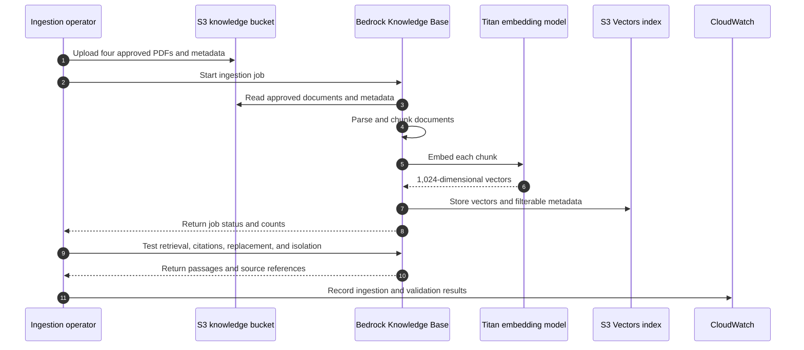
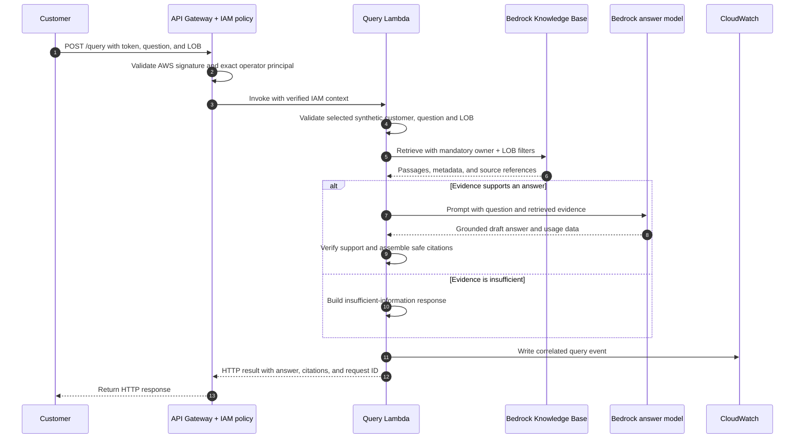

# Phase 1 AWS resource inventory and deployment order

This inventory implements the scope in [PHASE_1_AWS_POC_PLAN.md](PHASE_1_AWS_POC_PLAN.md): four synthetic policy PDFs, operator-authenticated customer-and-LOB filtering, grounded answers with citations, a Lambda query API, repeatable ingestion, and operational monitoring.

Status reflects the Phase 1 Terraform and repository workload implementations. **Implemented means code exists, not that AWS acceptance has passed.** **Defined means present in Terraform, not verified deployed.** The earlier 13-resource plan is superseded: the default development configuration defines 22 resources; enabling the query API adds 24, and each operator attachment adds one. Bootstrap remains separate. These are configuration counts, not an account-specific plan. Workload files and tests are inventoried in section 5. Ingestion CloudWatch emission and live acceptance checks remain outstanding; deployment evidence must establish that the tested Lambda artifact is deployed.

## Categories

| Category | Meaning |
|---|---|
| Must | Required by the agreed Phase 1 design or completion criteria. |
| Recommended | Explicit security configuration worth retaining, even when it is not a separate functional dependency. |
| Nice-to-have | Useful recovery or convenience feature that can be deferred. |
| Conditional | Required only when an existing identity, service, or configuration does not already supply the capability. |

A resource count includes IAM policies, bucket settings, and associations, not just running services. Reduce unused subsystems rather than removing security settings to achieve a smaller count.

## Architecture: two separate paths

Phase 1 has an **offline path** that prepares and verifies the searchable corpus and an **online path** that answers operator-authenticated requests for selected synthetic customers. The online path must not be enabled until the offline validation gate passes. Bootstrap and monitoring support both paths but are not request-processing stages.

### Offline: publish, ingest, and validate



“Offline” means that this is an operator-controlled preparation and validation path, not that it runs without AWS or network access. Retrieval in this path is a validation activity; it does not answer a customer request.

### Online: authenticate, retrieve, generate, and respond



The query Lambda is the online orchestrator. It is intended to enforce authorization, call filtered retrieval, invoke the answer model, validate/assemble citations from retrieved source metadata, apply the insufficient-information behavior, emit telemetry, and format the HTTP response. The **model produces only a draft answer (and model usage data)**; it does not create the trusted request ID or independently authorize citations. Lambda obtains the request ID from the API/Lambda invocation context and returns it with the answer and citations.

Terraform defines the Lambda resource, configuration, IAM permissions, API integration, and response requirements. The handler is implemented in [query.py](../src/apps/query_lambda/query.py), and [build_query_lambda.sh](../scripts/build_query_lambda.sh) packages it. The online sequence above remains the required acceptance contract, not verified deployed behavior. The handler restricts citation IDs to retrieved evidence; semantic answer support and citation correctness still require evaluation. The knowledge base invokes the embedding model during indexing and when embedding retrieval queries. Neither Bedrock model is a separately hosted application server in this design.

The online response fields have different sources and should not be treated as one Bedrock model response:

| Response field | Produced by | Trust rule |
|---|---|---|
| `answer` | Bedrock answer model drafts it; Lambda accepts it only when supported by retrieved evidence | Do not answer from model knowledge alone. Return the controlled insufficient-information response when evidence is inadequate. |
| `citations` | Lambda assembles them from Knowledge Base retrieval results and their source metadata | Do not trust model-generated source names. Return only sources that passed the same owner-and-LOB-filtered retrieval. |
| `request_id` | API Gateway request context, propagated by Lambda | Use for correlation only; it is not generated by the answer model and is not evidence. |

The current handler returns `answer`, `citations`, and `request_id` on success, or `error` (with `code` and `message`) plus `request_id` on failure. Verify this contract in deployed API tests before Phase 1 acceptance.

## 1. Bootstrap: Terraform state

**Order: first.** Reuse the existing bootstrap deployment if already provisioned. These six resources are separate from the development root.

Source: [bootstrap/main.tf](../infra/aws/terraform/bootstrap/main.tf).

| Terraform resource | Category | Status | Purpose |
|---|---|---|---|
| `aws_s3_bucket.state` | Must for this backend design | Defined | Stores Terraform state for the environment. |
| `aws_s3_bucket_versioning.state` | Recommended | Defined | Keeps state history for recovery from accidental replacement. |
| `aws_s3_bucket_server_side_encryption_configuration.state` | Recommended | Defined | Explicitly configures encryption at rest for state. |
| `aws_s3_bucket_public_access_block.state` | Recommended | Defined | Blocks public access to state. |
| `aws_s3_bucket_ownership_controls.state` | Recommended | Defined | Disables object ACLs and enforces bucket ownership. |
| `aws_s3_bucket_policy.state` | Recommended | Defined | Denies requests without TLS. |

Backend locking uses the configured S3 lockfile; no DynamoDB lock table is planned. Deployment identities need scoped access to their state and lock keys. Workload identities must not receive state access. These identity permissions may be supplied by the existing account setup rather than new resources in this root.

## 2. Offline path: ingestion and retrieval validation resources

**Order: after bootstrap, before the first AWS ingestion run.** The implementation retains all 13 resources below. The versioning configuration resource is always defined; versioning is suspended by default and enabled with `knowledge_bucket_versioning_enabled = true`.

Sources: [bedrock.tf](../infra/aws/terraform/development/bedrock.tf) and [ingestion.tf](../infra/aws/terraform/development/ingestion.tf).

| Terraform resource | Category | Status | Purpose and dependency |
|---|---|---|---|
| `aws_s3_bucket.knowledge` | Must | Defined | Stores the PDFs, metadata sidecars, and ingestion lock object. The data source reads only the dedicated POC prefix. |
| `aws_s3_bucket_public_access_block.knowledge` | Recommended | Defined | Blocks public document access. |
| `aws_s3_bucket_ownership_controls.knowledge` | Recommended | Defined | Uses bucket ownership and IAM policies instead of object ACLs. |
| `aws_s3_bucket_server_side_encryption_configuration.knowledge` | Recommended | Defined | Explicitly configures AES256 encryption at rest. |
| `aws_s3_bucket_policy.knowledge` | Recommended | Defined | Denies non-TLS document-bucket requests. |
| `aws_s3_bucket_versioning.knowledge` | Nice-to-have | Defined; opt-in enablement | When enabled, preserves earlier object versions for recovery. Does not itself remove obsolete content from retrieval. |
| `aws_s3vectors_vector_bucket.knowledge` | Must | Defined | Contains the selected vector storage backend. |
| `aws_s3vectors_index.knowledge` | Must | Defined | Stores 1,024-dimensional embeddings and metadata for similarity search. Owner and LOB remain filterable. |
| `aws_iam_role.knowledge` | Must | Defined | Service identity assumed by Bedrock Knowledge Bases. |
| `aws_iam_role_policy.knowledge` | Must | Defined | Grants the knowledge-base role scoped source-read, embedding-model, and vector-index permissions. |
| `aws_bedrockagent_knowledge_base.service` | Must | Defined | Connects the embedding model and vector index for ingestion and retrieval. |
| `aws_bedrockagent_data_source.service` | Must | Defined | Reads `approved/aws_poc/` and configures fixed-size 300-token chunks with 15% overlap. |
| `aws_iam_policy.ingestion_runner` | Must capability | Defined | Allows approved uploads, lock management, ingestion-job operations, and configuration checks. A separate managed policy is the chosen implementation. |

### Operator permissions

| Resource or capability | Category | Status | Purpose |
|---|---|---|---|
| `aws_iam_role_policy_attachment.ingestion_runner[0]` | Conditional | Defined; omitted by default | Attaches the runner policy to an existing role when `ingestion_runner_role_name` is set. Adds one resource to the plan. |
| Operator identity | Must capability | Supplied externally | Authenticates the CLI. Reuse an approved operator role; policy creation alone does not grant access. |
| Retrieval-validation permissions | Must capability | Defined | `aws_iam_policy.validation_runner` grants scoped retrieval, answer-model invocation and validation logging. Optional `validation_runner_role_name` attaches it to an existing trusted operator role. Kept separate from the ingestion policy. |
| Ingestion telemetry permissions | Must | Defined | Ingestion-runner policy grants scoped CreateLogStream/PutLogEvents; log-derived metric filters generate custom metrics. CLI emission remains application work. |

The lock is an S3 object managed by the ingestion application, not a new Terraform resource. The PDFs and sidecars are uploaded by the CLI, not managed as `aws_s3_object` resources.

## 3. Online path: authenticated query resources

**Order: after the offline infrastructure; enable query traffic only after retrieval and isolation validation passes.** Defined in `query.tf`, using a ZIP-packaged Lambda and an API Gateway REST API with operator-only IAM authentication. Resources use `[0]` when `enable_query_api = true`; deployment requires a readable artifact, an exact operator IAM ARN, and `index_validation_passed = true`.

| Terraform resource | Category | Status | Purpose and dependency |
|---|---|---|---|
| `aws_iam_role.query` | Must | Defined | Lambda execution identity with a Lambda service trust policy. |
| `aws_iam_role_policy.query` | Must | Defined | Grants knowledge-base retrieval, answer-model invocation, and scoped logging/telemetry permissions. |
| `aws_lambda_function.query` | Must | Infrastructure and handler implemented; deployment unverified | Hosts the online orchestrator in `src/apps/query_lambda/query.py`; package with `scripts/build_query_lambda.sh`. Live authentication, grounding, isolation, and telemetry acceptance remain required. |
| `aws_api_gateway_rest_api.query` | Must | Defined | Regional REST query API. |
| `aws_api_gateway_rest_api_policy.query` | Must | Defined | Allows the exact operator and explicitly denies every other principal. |
| `aws_api_gateway_resource.query` | Must | Defined | `/query` resource. |
| `aws_api_gateway_method.query` | Must | Defined | `POST` with `AWS_IAM` authentication. |
| `aws_api_gateway_integration.query` | Must | Defined | REST Lambda proxy integration. |
| `aws_api_gateway_deployment.query` | Must | Defined | Redeploys when method, integration or policy changes. |
| `aws_api_gateway_stage.query` | Must | Defined | Publishes `poc` and enables access logs. |
| `aws_api_gateway_method_settings.query` | Must | Defined | Throttling and metrics. |
| `aws_lambda_permission.api` | Must | Defined | Allows only the intended API stage/method to invoke Lambda through API Gateway. |

This is **12 defined resources**, excluding monitoring.

### Operator identity and synthetic customer selection

`query_operator_arn` selects one exact IAM principal in the account. Requests use
existing AWS credentials and SigV4. No Cognito, JWT provider, user passwords or
subject mappings are needed. All other principals are explicitly denied at the
API, including identities with broad same-account invocation permissions. Role
access includes everyone who can assume the selected role. Administrators who
can change the infrastructure can change these controls.

The approved operator supplies `owner_id` as `customer_one` or `customer_two`.
Every retrieval includes both the selected customer and validated LOB. This tests
customer document filtering; customer login isolation is outside Phase 1 scope.

## 4. Observability: resources defined alongside each pipeline

**Order: ingestion monitoring before ingestion acceptance; query monitoring before enabling the API.** Logs, metrics, a dashboard, and explicit log retention are required by the Phase 1 plan. Operators review these during ingestion and API tests. Automated alarms and alert delivery are outside Phase 1 scope; revisit them if the POC runs unattended or supports ongoing users.

| Resource or configuration | Category | Status | Purpose |
|---|---|---|---|
| `aws_cloudwatch_log_group.ingestion` | Must | Defined | Receives structured ingestion and index-validation events with explicit retention. |
| `aws_cloudwatch_log_group.query` | Must | Defined | Receives Lambda logs correlated by request ID, with explicit retention. |
| `aws_cloudwatch_log_group.api` | Must | Defined | Receives API access logs, including requests rejected before Lambda, with explicit retention. |
| API access-log delivery permissions | Must capability | Defined; verify live delivery | `aws_iam_role.api_logs`, `aws_iam_role_policy.api_logs`, and `aws_api_gateway_account.query` configure the regional API Gateway logging role. Reconcile any existing account setting before applying. |
| `aws_cloudwatch_log_metric_filter` resources | Must capability | Defined; live delivery unverified | Six ingestion/index filters, six query filters and one API authentication filter. Query handler emits structured events; ingestion/index CloudWatch publishing remains pending. Verify events match the metric-filter contract; no duplicate direct metric publishing. |
| `aws_cloudwatch_dashboard.poc` | Must | Defined | Shows ingestion and query activity, errors, latency, throttling, and application signals. |

Initial signals to collect:

- Ingestion job ID, status, elapsed time, documents processed/failed, and failure reason.
- Index-validation results, including missing documents, citation/source mismatches, and owner/LOB isolation failures.
- API request volume, authentication/authorization failures, server errors, and latency.
- Lambda errors, duration, and throttles.
- Retrieval result counts, citation presence, insufficient-information responses, and model token usage where available.

Application and CLI code must emit these events; provisioning log groups or a dashboard does not create telemetry. Avoid full policy text, questions, tokens, and credentials in logs. Avoid request IDs or user identities as metric dimensions. The ingestion CLI must exit unsuccessfully on failures or timeouts and retain a reviewable run report. Citation correctness requires evaluation, not just a citation-presence metric.

## 5. Required configuration and artifacts that are not separate infrastructure

| Item | Category | Purpose |
|---|---|---|
| Four synthetic PDFs and four metadata sidecars | Must | Provide the complete reviewed POC corpus and filterable metadata. |
| Embedding model selection | Must | Current configuration uses Titan Text Embeddings V2 at 1,024 dimensions; model and index dimensions must match. |
| Answer model selection/access | Must | RAG answer generation uses `bedrock_rag_answer_model_id` (default `amazon.nova-lite-v1:0`), passed to Lambda as `BEDROCK_RAG_ANSWER_MODEL_ID`; verify account/region access before deployed tests. |
| Lambda ZIP artifact and dependency packaging | Must | Deploy the query application without an ECR/container dependency. |
| Region, bucket/prefix, knowledge-base IDs, timeouts | Must | Keep environment configuration outside application code. |
| Evaluation fixtures and run reports | Must | Establish correct answers, source citations, isolation, and unsupported-question behavior. |
| API timeout, model token limit, and request throttling settings | Must configuration | Bound work and keep the synchronous query path within the selected API integration limits. Verify the latency budget during implementation. |

No dedicated model endpoint, new metadata database, or checkpoint store is proposed.

### Workload files and generated artifacts

These resources implement the Phase 1 workloads and do **not** add to the Terraform resource counts. Paths identify existing repository files; pending capabilities have no completed runner or acceptance evidence established by this inventory.

| Resource | Plan steps | Status | Purpose, dependencies, and output |
|---|---|---|---|
| [Policy corpus](../data/sample_insurance_policies/) and [documents.json](../data/sample_insurance_policies/documents.json) | 1–2 | Present | Four synthetic PDFs and four `.pdf.metadata.json` sidecars for two owners across Auto and Property. Source JSON stays local. |
| [generate_poc_policies.py](../scripts/generate_poc_policies.py) | 1 | Implemented | Uses ReportLab to generate policy PDFs from `documents.json`. Review regenerated documents and update fixtures before ingestion. |
| [prepare_poc_metadata.py](../scripts/prepare_poc_metadata.py) | 2 | Implemented | Validates the complete corpus before writing sidecars; `--check` verifies current sidecars without writing. |
| [pdf.py](../src/ingestion/pdf.py), [metadata.py](../src/ingestion/metadata.py), [corpus.py](../src/ingestion/corpus.py) | 2 | Implemented | Separate PDF parsing, deterministic labeled-field extraction, owner/policy/LOB validation, and corpus/sidecar checks. |
| [ingest_poc.py](../scripts/ingest_poc.py) | 3 | Implemented; AWS run evidence required | Operator CLI reads environment settings or applied Terraform `ingestion_environment`, validates and uploads the eight approved objects, starts ingestion, and writes a JSON report. Requires AWS credentials and offline resources; no API deployment dependency. |
| [offline.py](../src/ingestion/offline.py) and [jobs.py](../src/ingestion/jobs.py) | 3–4 | Implemented | Validation of a local copy of policy PDFs and metadata before upload, live configuration checks, conditional S3 locking, stable policy keys for replacement, upload sequencing, job polling, document-failure checks, and timeout recovery. Retrieval after replacement still needs verification. |
| `ingestion_reports/<timestamp>_<unique_id>.json` | 3, 8 | Generated per CLI run; gitignored | Records hashes, uploads, job ID/status/statistics, duration, failures, and lock state. `--report PATH` selects another location. Local reports exist independently of CloudWatch delivery. |
| [bedrock_smoke.py](../scripts/bedrock_smoke.py) | Supporting diagnostics | Existing utility; not the Phase 1 acceptance runner | Provides model/retrieval/ingestion diagnostics. Its `ingest` operation bypasses POC locking; use `ingest_poc.py` for the managed POC data source. Generic retrieval does not establish owner-and-LOB isolation. |
| [query.py](../src/apps/query_lambda/query.py) | 5–6, 8 | Implemented; deployed verification pending | `query.handler` consumes API Gateway IAM context, validates the operator and selected customer and owner/LOB retrieval filters, calls Bedrock Converse, assembles citations, returns controlled insufficient-information responses, and prints structured query events. Requires Terraform-provided model, KB, and operator ARN configuration. |
| [build_query_lambda.sh](../scripts/build_query_lambda.sh) → `build/lambda/query.zip` | 7 | Packaging implemented | Compiles and ZIPs the handler as `query.py`; uses the Lambda runtime's Boto3/Botocore rather than bundling dependencies. Build and test the artifact before enabling the API. |
| [questions.json](../tests/fixtures/aws_poc/questions.json) | 1, 4, 9 | Present; live evaluation pending | Expected answers, allowed document IDs, supporting passages, paired owner cases, and unsupported questions. Fixtures alone are not an executed evaluation. |
| Ingestion/index CloudWatch publisher | 8 | Pending | Publish the documented ingestion and validation events to the provisioned log group; verify failure metrics and dashboard visibility. The current ingestion CLI writes a local report only. |

### Test resources and acceptance coverage

| Test resource | Execution boundary | Coverage and remaining gate |
|---|---|---|
| [test_poc_metadata.py](../tests/unit/test_poc_metadata.py) | Local PDFs and sidecars | Checks extraction, required labels/values, owner assignments, exact corpus inventory, stale sidecars, and validation before writes. Manual PDF review remains required. |
| [test_offline_ingestion.py](../tests/unit/test_offline_ingestion.py) | Local workload orchestration with AWS mocks | Checks approved uploads, configuration mismatches, concurrent runs, partial failures, job/document failures, timeouts, uncertain responses, reruns, revised document IDs, and unknown remote inventory. Does not establish live indexing or removal of obsolete content. |
| [test_query_lambda.py](../tests/unit/test_query_lambda.py) | Handler with simulated IAM context and mocked Bedrock | Checks missing/unapproved-identity rejection, owner-and-LOB retrieval filters, synthetic customer selection, invalid inputs, citation handling, and insufficient evidence. Does not exercise IAM verification at API Gateway or model answer accuracy. |
| [test_journey.py](../tests/integration/test_journey.py) | Local FastAPI `TestClient`, temporary SQLite stores, synthetic core and identities | Existing claims-intake/service integration regression suite, including ownership and restart behavior. It does not exercise the Phase 1 Lambda/API Gateway/Knowledge Base path and cannot satisfy Phase 1 deployed acceptance. |
| [phase1.tftest.hcl](../infra/aws/terraform/development/tests/phase1.tftest.hcl) and [foundation.tftest.hcl](../infra/aws/terraform/development/tests/foundation.tftest.hcl) | Terraform with mocked providers | Validate infrastructure configuration and deployment gates; do not prove AWS resource readiness or workload behavior. |
| Phase 1 live retrieval and replacement checks | AWS; required, dedicated runner pending | Retrieve all four documents with correct sources and owner/LOB filters, then revise and reingest a policy and verify new content is returned and superseded content is absent. Preserve a reviewable validation report before enabling queries. |
| [test_online_rag.py](../scripts/test_online_rag.py) | Deployed AWS API; runner implemented, live execution pending | Runs fixtures for both customers with SigV4 signing, citation/amount checks, unsupported cases, missing/invalid signatures, and invalid customer/question/LOB input. Another-principal check requires separate credentials. Saves responses and request IDs. Human answer/citation review, controlled backend failures and CloudWatch evidence remain required. See [online RAG testing](ONLINE_RAG_TESTING.md). |

Run these commands from the repository root with dependencies installed using `uv sync --locked`:

```sh
# Check the corpus without rewriting sidecars.
PYTHONPATH=src uv run --locked python scripts/prepare_poc_metadata.py --check

# Local unit coverage, including metadata, ingestion, and query Lambda.
PYTHONPATH=src:. uv run --locked python -m unittest discover -s tests/unit -v

# Existing local application integration regression suite.
PYTHONPATH=src uv run --locked python -m unittest discover -s tests/integration -v

# Package the query handler for the Terraform Lambda deployment.
uv run --locked bash scripts/build_query_lambda.sh
```

After provisioning the offline resources and operator permissions, run the AWS workload using the [offline ingestion runbook](OFFLINE_INGESTION.md):

```sh
PYTHONPATH=src uv run --locked python scripts/ingest_poc.py \
  --terraform-dir infra/aws/terraform/development
```

A successful local test run, ZIP build, or ingestion report does not close the live retrieval, authentication, answer-quality, or telemetry gates above.

## 6. Deployment order and acceptance gates

Terraform resolves resource dependencies within a root. The order below describes deployment milestones and application acceptance gates, not manual creation of each resource.

| Order | Work | Dependencies | Gate before proceeding |
|---|---|---|---|
| 0 | Prepare PDFs, metadata, expected answers, and identity choices | Agreed Phase 1 scope | Four reviewed documents and owner mappings; no ambiguous policy ownership. |
| 1 | Verify/reuse or deploy bootstrap | Account, deployment identity, backend configuration | Correct remote state and locking configured. |
| 2 | Deploy the offline foundation and operator permissions | Bootstrap | Correct bucket prefix, compatible index/model, and usable operator access. |
| 3 | Add ingestion logs and failure metrics | Offline foundation | CLI telemetry reaches CloudWatch; failures produce an unsuccessful exit and a reviewable run report. |
| 4 | Run ingestion and index validation | Reviewed corpus, operator access, monitoring | All four documents indexed; owner/LOB isolation, source references, and document replacement pass. |
| 5 | Deploy IAM authentication, customer selection, Lambda/API, and query observability | Identity choice and retrieval validation | Unsigned/invalid requests and unapproved principals rejected; mandatory filters enforced; logs and metrics visible. |
| 6 | Run authenticated end-to-end and controlled-failure tests | Online deployment | Expected answers/citations, different-owner answers, unsupported cases, and failure visibility in logs and metrics pass. |
| 7 | Record repeatable deployment/test instructions | Passing acceptance checks | Reviewable reports, configuration instructions, and teardown procedure available. |

Ingestion and API code can be developed in parallel with infrastructure. Do not interpret a successful Terraform apply or ingestion job as proof of retrieval correctness or owner isolation.

## 7. Resource-count accounting and implementation choices

| Scope | Count/status |
|---|---|
| Bootstrap | 6 defined resources, separate state/root. |
| Default development configuration | 22 defined resources: original 13 plus validation policy, ingestion log group, six filters and dashboard. |
| Optional operator attachments | +1 each for ingestion and validation roles when configured. |
| Query REST API/Lambda/IAM policy | +12 when enabled. |
| Additional online monitoring | +12 when enabled: two log groups, logging role/policy/account setting and seven metric filters. |
| Identity provider | No new resources; uses existing AWS credentials. |

The enabled development subtotal is **46 resources** (22 + 12 + 12), before optional operator attachments. These are configuration counts, **not a generated final Terraform plan**.

Implemented defaults: operator-only IAM signatures; 14-day retention; log-derived custom metrics; 28-second Lambda timeout within a 29-second API integration timeout; 512 output tokens; API rate 2/second and burst 5. The operator must supply the exact operator ARN and the tested Lambda artifact, attest offline validation, and verify model latency and log delivery. See the Terraform runbook for the handler and telemetry contracts. Generate a fresh account-specific plan before applying.

## Related files

- [Phase 1 requirements and completion criteria](PHASE_1_AWS_POC_PLAN.md)
- [Terraform setup and teardown](../infra/aws/terraform/README.md)
- [Offline ingestion runbook](OFFLINE_INGESTION.md)
