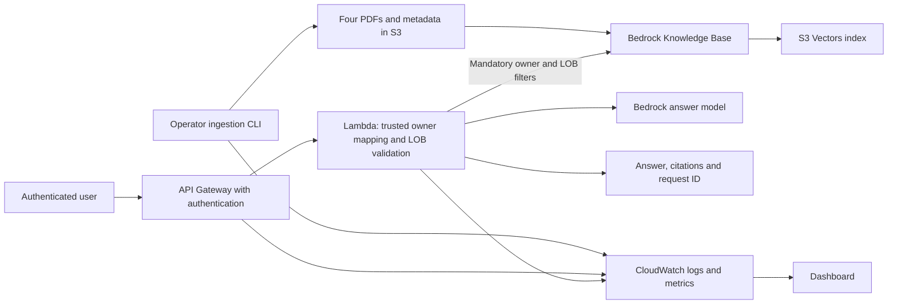

# Phase 1 AWS resource inventory and deployment order

This inventory implements the scope in [PHASE_1_AWS_POC_PLAN.md](PHASE_1_AWS_POC_PLAN.md): four synthetic policy PDFs, authenticated owner-and-LOB isolation, grounded answers with citations, a Lambda query API, repeatable ingestion, and operational monitoring.

Status reflects the Phase 1 Terraform implementation. **Defined means present in Terraform, not verified deployed.** The earlier 13-resource plan is superseded: the default development configuration defines 22 resources; enabling the query API adds 19, optional Cognito adds two, and each operator attachment adds one. Bootstrap remains separate. These are configuration counts, not an account-specific plan. Application artifacts, telemetry emission, and live acceptance checks remain outstanding.

## Categories

| Category | Meaning |
|---|---|
| Must | Required by the agreed Phase 1 design or completion criteria. |
| Recommended | Explicit security configuration worth retaining, even when it is not a separate functional dependency. |
| Nice-to-have | Useful recovery or convenience feature that can be deferred. |
| Conditional | Required only when an existing identity, service, or configuration does not already supply the capability. |

A resource count includes IAM policies, bucket settings, and associations, not just running services. Reduce unused subsystems rather than removing security settings to achieve a smaller count.

## Architecture

The knowledge base invokes the embedding model during indexing. The query Lambda retrieves policy evidence and invokes the answer model. Neither model is a separately hosted application server in this design.

## 1. Bootstrap: Terraform state

**Order: first.** Reuse the existing bootstrap deployment if already provisioned. These six resources are separate from the development root.

Source: [bootstrap/main.tf](../infra/aws/terraform/bootstrap/main.tf).

| Terraform resource | Category | Status | Purpose |
|---|---|---|---|
| `aws_s3_bucket.state` | Must for this backend design | Defined | Stores Terraform state for the environment. |
| `aws_s3_bucket_versioning.state` | Recommended | Defined | Keeps state history for recovery from accidental replacement. |
| `aws_s3_bucket_server_side_encryption_configuration.state` | Recommended | Defined | Explicitly configures encryption at rest for state. |
| `aws_s3_bucket_public_access_block.state` | Recommended | Defined | Blocks public access to state. |
| `aws_s3_bucket_ownership_controls.state` | Recommended | Defined | Disables object ACLs and enforces bucket ownership. |
| `aws_s3_bucket_policy.state` | Recommended | Defined | Denies requests without TLS. |

Backend locking uses the configured S3 lockfile; no DynamoDB lock table is planned. Deployment identities need scoped access to their state and lock keys. Workload identities must not receive state access. These identity permissions may be supplied by the existing account setup rather than new resources in this root.

## 2. Offline ingestion and retrieval: current development resources

**Order: after bootstrap, before the first AWS ingestion run.** Keep all 13 resources below; versioning is optional but retained for recovery.

Sources: [bedrock.tf](../infra/aws/terraform/development/bedrock.tf) and [ingestion.tf](../infra/aws/terraform/development/ingestion.tf).

| Terraform resource | Category | Status | Purpose and dependency |
|---|---|---|---|
| `aws_s3_bucket.knowledge` | Must | Defined | Stores the PDFs, metadata sidecars, and ingestion lock object. The data source reads only the dedicated POC prefix. |
| `aws_s3_bucket_public_access_block.knowledge` | Recommended | Defined | Blocks public document access. |
| `aws_s3_bucket_ownership_controls.knowledge` | Recommended | Defined | Uses bucket ownership and IAM policies instead of object ACLs. |
| `aws_s3_bucket_server_side_encryption_configuration.knowledge` | Recommended | Defined | Explicitly configures AES256 encryption at rest. |
| `aws_s3_bucket_policy.knowledge` | Recommended | Defined | Denies non-TLS document-bucket requests. |
| `aws_s3_bucket_versioning.knowledge` | Nice-to-have | Defined; retained | Preserves earlier object versions for recovery. Does not itself remove obsolete content from retrieval. |
| `aws_s3vectors_vector_bucket.knowledge` | Must | Defined | Contains the selected vector storage backend. |
| `aws_s3vectors_index.knowledge` | Must | Defined | Stores 1,024-dimensional embeddings and metadata for similarity search. Owner and LOB remain filterable. |
| `aws_iam_role.knowledge` | Must | Defined | Service identity assumed by Bedrock Knowledge Bases. |
| `aws_iam_role_policy.knowledge` | Must | Defined | Grants the knowledge-base role scoped source-read, embedding-model, and vector-index permissions. |
| `aws_bedrockagent_knowledge_base.service` | Must | Defined | Connects the embedding model and vector index for ingestion and retrieval. |
| `aws_bedrockagent_data_source.service` | Must | Defined | Reads `approved/aws_poc/` and configures fixed-size 300-token chunks with 15% overlap. |
| `aws_iam_policy.ingestion_runner` | Must capability | Defined | Allows approved uploads, lock management, ingestion-job operations, and configuration checks. A separate managed policy is the chosen implementation. |

### Operator permissions

| Resource or capability | Category | Status | Purpose |
|---|---|---|---|
| `aws_iam_role_policy_attachment.ingestion_runner[0]` | Conditional | Defined; omitted by default | Attaches the runner policy to an existing role when `ingestion_runner_role_name` is set. Adds one resource to the plan. |
| Operator identity | Must capability | Supplied externally | Authenticates the CLI. Reuse an approved operator role; policy creation alone does not grant access. |
| Retrieval-validation permissions | Must capability | Defined | `aws_iam_policy.validation_runner` grants scoped retrieval, answer-model invocation and validation logging. Optional `validation_runner_role_name` attaches it to an existing trusted operator role. Kept separate from the ingestion policy. |
| Ingestion telemetry permissions | Must | Defined | Ingestion-runner policy grants scoped CreateLogStream/PutLogEvents; log-derived metric filters generate custom metrics. CLI emission remains application work. |

The lock is an S3 object managed by the ingestion application, not a new Terraform resource. The PDFs and sidecars are uploaded by the CLI, not managed as `aws_s3_object` resources.

## 3. Authenticated query API: opt-in resources

**Order: after the offline infrastructure; enable query traffic only after retrieval and isolation validation passes.** Defined in `query.tf`, using a ZIP-packaged Lambda and an API Gateway HTTP API with JWT authentication. Resources use `[0]` when `enable_query_api = true`; deployment requires a readable artifact, two owner mappings, identity configuration, and `index_validation_passed = true`.

| Terraform resource | Category | Status | Purpose and dependency |
|---|---|---|---|
| `aws_iam_role.query` | Must | Defined | Lambda execution identity with a Lambda service trust policy. |
| `aws_iam_role_policy.query` | Must | Defined | Grants knowledge-base retrieval, answer-model invocation, and scoped logging/telemetry permissions. |
| `aws_lambda_function.query` | Must | Defined | Validates input, derives the trusted owner, applies owner-and-LOB retrieval filters, generates grounded answers, and returns citations and request ID. |
| `aws_apigatewayv2_api.query` | Must | Defined | Defines the HTTP query API. |
| `aws_apigatewayv2_authorizer.query` | Must for JWT design | Defined | Validates tokens from the selected issuer and audience before query execution. |
| `aws_apigatewayv2_integration.query` | Must | Defined | Connects the API to Lambda. |
| `aws_apigatewayv2_route.query` | Must | Defined | Defines the authenticated query route, for example `POST /query`. |
| `aws_apigatewayv2_stage.query` | Must | Defined | Publishes the API stage and configures access logging and throttling. |
| `aws_lambda_permission.api` | Must | Defined | Allows the intended API Gateway source to invoke the query function. |

This is **nine defined resources**, excluding identity-provider resources and monitoring. If stage auto-deployment is selected, a separate API deployment resource is not planned. Revisit the inventory if the API or authentication design changes.

### Identity and owner mapping

| Resource or capability | Category | Status | Purpose |
|---|---|---|---|
| Existing JWT identity provider | Must capability; reuse preferred | Configurable | Supplies verified identities for the two synthetic users. |
| `aws_cognito_user_pool.poc` | Conditional | Defined; opt-in | Supplies an identity provider when no suitable existing provider is available. |
| `aws_cognito_user_pool_client.poc` | Conditional | Defined; opt-in | Configures the chosen client authentication flow and token audience. |
| Cognito domain | Conditional | Not needed for selected flow | Optional Cognito uses SRP sign-in and refresh tokens without a hosted UI. |
| Two synthetic test identities | Must capability | Provision through selected provider | Enable deployed tests for both owners. Avoid storing user passwords in Terraform configuration or state. |
| Trusted identity-to-owner mapping | Must | Defined as configuration; handler enforcement pending | Maps verified issuer/subject identities to approved `owner_id` values. For two users, no database is required. |

Authentication is not sufficient on its own. Reject valid but unmapped identities. Never accept a caller-supplied owner ID as authorization. Every retrieval must include both the mapped owner and the validated LOB before evidence reaches answer generation.

## 4. Observability: resources defined alongside each pipeline

**Order: ingestion monitoring before ingestion acceptance; query monitoring before enabling the API.** Logs, metrics, a dashboard, and explicit log retention are required by the Phase 1 plan. Operators review these during ingestion and API tests. Automated alarms and alert delivery are outside Phase 1 scope; revisit them if the POC runs unattended or supports ongoing users.

| Resource or configuration | Category | Status | Purpose |
|---|---|---|---|
| `aws_cloudwatch_log_group.ingestion` | Must | Defined | Receives structured ingestion and index-validation events with explicit retention. |
| `aws_cloudwatch_log_group.query` | Must | Defined | Receives Lambda logs correlated by request ID, with explicit retention. |
| `aws_cloudwatch_log_group.api` | Must | Defined | Receives API access logs, including requests rejected before Lambda, with explicit retention. |
| API access-log delivery permissions | Must capability | Defined; verify live delivery | `aws_cloudwatch_log_resource_policy.api[0]` scopes delivery to the API group. External deployment identity also needs CloudWatch log-delivery setup permissions. |
| `aws_cloudwatch_log_metric_filter` resources | Must capability | Defined; emission pending | Six ingestion/index filters, six query filters and one API authentication filter. Application/CLI must emit the documented JSON events; no duplicate direct metric publishing. |
| `aws_cloudwatch_dashboard.poc` | Must | Defined | Shows ingestion and query activity, errors, latency, throttling, and application signals. |

Initial signals to collect:

- Ingestion job ID, status, elapsed time, documents processed/failed, and failure reason.
- Index-validation results, including missing documents, citation/source mismatches, and owner/LOB isolation failures.
- API request volume, authentication/authorization failures, server errors, and latency.
- Lambda errors, duration, and throttles.
- Retrieval result counts, citation presence, insufficient-information responses, and model token usage where available.

Application and CLI code must emit these events; provisioning log groups or a dashboard does not create telemetry. Avoid full policy text, questions, tokens, and credentials in logs. Avoid request IDs or user identities as metric dimensions. The ingestion CLI must exit unsuccessfully on failures or timeouts and retain a reviewable run report. Citation correctness requires evaluation, not just a citation-presence metric.

## 5. Required configuration and artifacts that are not separate infrastructure

| Item | Category | Purpose |
|---|---|---|
| Four synthetic PDFs and four metadata sidecars | Must | Provide the complete reviewed POC corpus and filterable metadata. |
| Embedding model selection | Must | Current configuration uses Titan Text Embeddings V2 at 1,024 dimensions; model and index dimensions must match. |
| Answer model selection/access | Must | Current configured model ID is `amazon.nova-lite-v1:0`; verify account/region access before deployed tests. |
| Lambda ZIP artifact and dependency packaging | Must | Deploy the query application without an ECR/container dependency. |
| Region, bucket/prefix, knowledge-base IDs, timeouts | Must | Keep environment configuration outside application code. |
| Evaluation fixtures and run reports | Must | Establish correct answers, source citations, isolation, and unsupported-question behavior. |
| API timeout, model token limit, and request throttling settings | Must configuration | Bound work and keep the synchronous query path within the selected API integration limits. Verify the latency budget during implementation. |

No dedicated model endpoint, new metadata database, or checkpoint store is proposed.

## 6. Deployment order and acceptance gates

Terraform resolves resource dependencies within a root. The order below describes deployment milestones and application acceptance gates, not manual creation of each resource.

| Order | Work | Dependencies | Gate before proceeding |
|---|---|---|---|
| 0 | Prepare PDFs, metadata, expected answers, and identity choices | Agreed Phase 1 scope | Four reviewed documents and owner mappings; no ambiguous policy ownership. |
| 1 | Verify/reuse or deploy bootstrap | Account, deployment identity, backend configuration | Correct remote state and locking configured. |
| 2 | Deploy the offline foundation and operator permissions | Bootstrap | Correct bucket prefix, compatible index/model, and usable operator access. |
| 3 | Add ingestion logs and failure metrics | Offline foundation | CLI telemetry reaches CloudWatch; failures produce an unsuccessful exit and a reviewable run report. |
| 4 | Run ingestion and index validation | Reviewed corpus, operator access, monitoring | All four documents indexed; owner/LOB isolation, source references, and document replacement pass. |
| 5 | Deploy authentication, owner mapping, Lambda/API, and query observability | Identity choice and retrieval validation | Unauthenticated/unmapped users rejected; mandatory filters enforced; logs and metrics visible. |
| 6 | Run authenticated end-to-end and controlled-failure tests | Online deployment | Expected answers/citations, different-owner answers, unsupported cases, and failure visibility in logs and metrics pass. |
| 7 | Record repeatable deployment/test instructions | Passing acceptance checks | Reviewable reports, configuration instructions, and teardown procedure available. |

Ingestion and API code can be developed in parallel with infrastructure. Do not interpret a successful Terraform apply or ingestion job as proof of retrieval correctness or owner isolation.

## 7. Resource-count accounting and implementation choices

| Scope | Count/status |
|---|---|
| Bootstrap | 6 defined resources, separate state/root. |
| Default development configuration | 22 defined resources: original 13 plus validation policy, ingestion log group, six filters and dashboard. |
| Optional operator attachments | +1 each for ingestion and validation roles when configured. |
| Query API/Lambda/JWT authorizer | +9 when enabled. |
| Additional online monitoring | +10 when enabled: two log groups, one delivery policy and seven metric filters. |
| Identity provider | +0 for an existing provider or +2 for optional Cognito pool/client. Users/passwords are provisioned outside Terraform. |

The enabled development subtotal is **41 resources** (22 + 9 + 10), or **43 with Cognito**, before optional operator attachments. These are configuration counts, **not a generated final Terraform plan**.

Implemented defaults: existing JWT provider or optional Cognito SRP; 14-day retention; log-derived custom metrics; 28-second Lambda timeout within a 30-second API integration timeout; 512 output tokens; API rate 2/second and burst 5. The operator must supply actual verified subjects and the tested Lambda artifact, attest offline validation, and verify model latency and log delivery. See the Terraform runbook for the handler and telemetry contracts. Generate a fresh account-specific plan before applying.

## Related files

- [Phase 1 requirements and completion criteria](PHASE_1_AWS_POC_PLAN.md)
- [Terraform setup and teardown](../infra/aws/terraform/README.md)
- [Offline ingestion runbook](OFFLINE_INGESTION.md)
