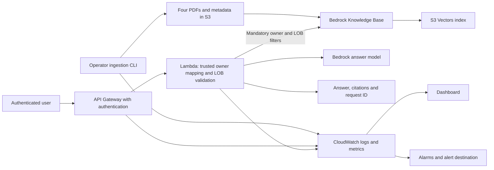

# Phase 1 AWS resource inventory and deployment order

This inventory implements the scope in [PHASE_1_AWS_POC_PLAN.md](PHASE_1_AWS_POC_PLAN.md): four synthetic policy PDFs, authenticated owner-and-LOB isolation, grounded answers with citations, a Lambda query API, repeatable ingestion, and operational monitoring.

Status reflects the repository after the Phase 1 Terraform cleanup. **Defined means present in Terraform, not verified deployed.** The reviewed development plan contains **13 additions, 0 changes, and 0 destructions**. Bootstrap is a separate root. Proposed resource addresses below are implementation suggestions, not existing configuration.

## Categories

| Category | Meaning |
|---|---|
| Must | Required by the agreed Phase 1 design or completion criteria. |
| Recommended | Explicit security configuration worth retaining, even when it is not a separate functional dependency. |
| Nice-to-have | Useful recovery or convenience feature that can be deferred. |
| Conditional | Required only when an existing identity, service, or configuration does not already supply the capability. |
| Deferred | Outside Phase 1; removed from the active Terraform configuration. |

A resource count includes IAM policies, bucket settings, and associations, not just running services. Reduce unused subsystems rather than removing security settings to achieve a smaller count.

## Architecture

The knowledge base invokes the embedding model during indexing. The query Lambda retrieves policy evidence and invokes the answer model. Neither model is a separately hosted application server in this design.

## 1. Bootstrap: Terraform state

**Order: first.** Reuse the existing bootstrap deployment if already provisioned. These six resources are separate from the 13-resource development plan.

Source: [bootstrap/main.tf](../infra/aws/terraform/bootstrap/main.tf).

| Terraform resource | Category | Status | Purpose |
|---|---|---|---|
| `aws_s3_bucket.state` | Must for this backend design | Defined | Stores Terraform state for the environment. |
| `aws_s3_bucket_versioning.state` | Recommended | Defined | Keeps state history for recovery from accidental replacement. |
| `aws_s3_bucket_server_side_encryption_configuration.state` | Recommended | Defined | Explicitly configures encryption at rest for state. |
| `aws_s3_bucket_public_access_block.state` | Recommended | Defined | Blocks public access to state. |
| `aws_s3_bucket_ownership_controls.state` | Recommended | Defined | Disables object ACLs and enforces bucket ownership. |
| `aws_s3_bucket_policy.state` | Recommended | Defined | Denies requests without TLS. |

Backend locking uses the configured S3 lockfile; no DynamoDB lock table is planned. Deployment identities need scoped access to their state and lock keys. Workload identities must not receive state access. These identity permissions may be supplied by the existing account setup rather than new resources in this root.

## 2. Offline ingestion and retrieval: current development resources

**Order: after bootstrap, before the first AWS ingestion run.** Keep all 13 resources below; versioning is optional but retained for recovery.

Sources: [bedrock.tf](../infra/aws/terraform/development/bedrock.tf) and [ingestion.tf](../infra/aws/terraform/development/ingestion.tf).

| Terraform resource | Category | Status | Purpose and dependency |
|---|---|---|---|
| `aws_s3_bucket.knowledge` | Must | Defined | Stores the PDFs, metadata sidecars, and ingestion lock object. The data source reads only the dedicated POC prefix. |
| `aws_s3_bucket_public_access_block.knowledge` | Recommended | Defined | Blocks public document access. |
| `aws_s3_bucket_ownership_controls.knowledge` | Recommended | Defined | Uses bucket ownership and IAM policies instead of object ACLs. |
| `aws_s3_bucket_server_side_encryption_configuration.knowledge` | Recommended | Defined | Explicitly configures AES256 encryption at rest. |
| `aws_s3_bucket_policy.knowledge` | Recommended | Defined | Denies non-TLS document-bucket requests. |
| `aws_s3_bucket_versioning.knowledge` | Nice-to-have | Defined; retained | Preserves earlier object versions for recovery. Does not itself remove obsolete content from retrieval. |
| `aws_s3vectors_vector_bucket.knowledge` | Must | Defined | Contains the selected vector storage backend. |
| `aws_s3vectors_index.knowledge` | Must | Defined | Stores 1,024-dimensional embeddings and metadata for similarity search. Owner and LOB remain filterable. |
| `aws_iam_role.knowledge` | Must | Defined | Service identity assumed by Bedrock Knowledge Bases. |
| `aws_iam_role_policy.knowledge` | Must | Defined | Grants the knowledge-base role scoped source-read, embedding-model, and vector-index permissions. |
| `aws_bedrockagent_knowledge_base.service` | Must | Defined | Connects the embedding model and vector index for ingestion and retrieval. |
| `aws_bedrockagent_data_source.service` | Must | Defined | Reads `approved/aws_poc/` and configures fixed-size 300-token chunks with 15% overlap. |
| `aws_iam_policy.ingestion_runner` | Must capability | Defined | Allows approved uploads, lock management, ingestion-job operations, and configuration checks. A separate managed policy is the chosen implementation. |

### Operator permissions

| Resource or capability | Category | Status | Purpose |
|---|---|---|---|
| `aws_iam_role_policy_attachment.ingestion_runner[0]` | Conditional | Defined; omitted by default | Attaches the runner policy to an existing role when `ingestion_runner_role_name` is set. Adds one resource to the plan. |
| Operator identity | Must capability | Supplied externally | Authenticates the CLI. Reuse an approved operator role; policy creation alone does not grant access. |
| Retrieval-validation permissions | Must capability | Verify/add | Allow the validation operator to retrieve from the knowledge base and invoke the answer model when evaluating answers. The current ingestion-runner policy does not grant `bedrock:Retrieve` or answer-model invocation. |
| Ingestion telemetry permissions | Must | To add | Allow the CLI to publish logs and metrics to the chosen CloudWatch destinations. Extend the operator policy as part of monitoring implementation. |

The lock is an S3 object managed by the ingestion application, not a new Terraform resource. The PDFs and sidecars are uploaded by the CLI, not managed as `aws_s3_object` resources.

## 3. Authenticated query API: resources to add

**Order: after the offline infrastructure; enable query traffic only after retrieval and isolation validation passes.** Proposed addresses assume a ZIP-packaged Lambda and an API Gateway HTTP API with JWT authentication.

| Proposed Terraform resource | Category | Status | Purpose and dependency |
|---|---|---|---|
| `aws_iam_role.query` | Must | To add | Lambda execution identity with a Lambda service trust policy. |
| `aws_iam_role_policy.query` | Must | To add | Grants knowledge-base retrieval, answer-model invocation, and scoped logging/telemetry permissions. |
| `aws_lambda_function.query` | Must | To add | Validates input, derives the trusted owner, applies owner-and-LOB retrieval filters, generates grounded answers, and returns citations and request ID. |
| `aws_apigatewayv2_api.query` | Must | To add | Defines the HTTP query API. |
| `aws_apigatewayv2_authorizer.query` | Must for JWT design | To add | Validates tokens from the selected issuer and audience before query execution. |
| `aws_apigatewayv2_integration.query` | Must | To add | Connects the API to Lambda. |
| `aws_apigatewayv2_route.query` | Must | To add | Defines the authenticated query route, for example `POST /query`. |
| `aws_apigatewayv2_stage.query` | Must | To add | Publishes the API stage and configures access logging and throttling. |
| `aws_lambda_permission.api` | Must | To add | Allows the intended API Gateway source to invoke the query function. |

This is **nine proposed resources**, excluding identity-provider resources and monitoring. If stage auto-deployment is selected, a separate API deployment resource is not planned. Revisit the inventory if the API or authentication design changes.

### Identity and owner mapping

| Resource or capability | Category | Status | Purpose |
|---|---|---|---|
| Existing JWT identity provider | Must capability; reuse preferred | Selection pending | Supplies verified identities for the two synthetic users. |
| `aws_cognito_user_pool.poc` | Conditional | To add only if needed | Supplies an identity provider when no suitable existing provider is available. |
| `aws_cognito_user_pool_client.poc` | Conditional | To add only with Cognito | Configures the chosen client authentication flow and token audience. |
| Cognito domain | Conditional | Depends on login flow | Needed if the selected hosted sign-in flow requires it. |
| Two synthetic test identities | Must capability | Provision through selected provider | Enable deployed tests for both owners. Avoid storing user passwords in Terraform configuration or state. |
| Trusted identity-to-owner mapping | Must | To implement as deployment configuration | Maps verified issuer/subject identities to approved `owner_id` values. For two users, no database is required. |

Authentication is not sufficient on its own. Reject valid but unmapped identities. Never accept a caller-supplied owner ID as authorization. Every retrieval must include both the mapped owner and the validated LOB before evidence reaches answer generation.

## 4. Observability: resources to add alongside each pipeline

**Order: ingestion monitoring before ingestion acceptance; query monitoring before enabling the API.** Dashboards, alarms, an alert destination, and explicit log retention are required by the written Phase 1 plan.

| Proposed resource or configuration | Category | Status | Purpose |
|---|---|---|---|
| `aws_cloudwatch_log_group.ingestion` | Must | To add | Receives structured ingestion and index-validation events with explicit retention. |
| `aws_cloudwatch_log_group.query` | Must | To add | Receives Lambda logs correlated by request ID, with explicit retention. |
| `aws_cloudwatch_log_group.api` | Must | To add | Receives API access logs, including requests rejected before Lambda, with explicit retention. |
| API access-log delivery permissions | Must capability | To configure/verify | Authorizes delivery to the selected log group; add resource-policy configuration if required by the selected delivery setup. |
| Custom metric emission or `aws_cloudwatch_log_metric_filter` resources | Must capability | To implement | Turns ingestion/application events into metrics. Choose direct metric publishing or log-derived metrics; do not create duplicate metrics through both paths. |
| `aws_cloudwatch_dashboard.poc` | Must | To add | Shows ingestion and query activity, errors, latency, throttling, and application signals. |
| `aws_cloudwatch_metric_alarm.ingestion_failures` | Must | To add | Alerts on failed/timed-out ingestion runs or document failures. |
| `aws_cloudwatch_metric_alarm.api_errors` | Must | To add | Alerts on API server errors; also display client/authentication failures separately. |
| `aws_cloudwatch_metric_alarm.lambda_errors` | Must | To add | Alerts on query-function execution failures. |
| `aws_cloudwatch_metric_alarm.lambda_throttles` | Must | To add | Alerts when Lambda rejects invocations because of throttling. |
| `aws_sns_topic.alerts` | Conditional resource; destination is Must | To add or reuse | Receives alarm notifications. Reuse a suitable existing alert destination if available. |
| `aws_sns_topic_subscription.alert_email` | Conditional resource; delivery is Must | To add or reuse | Delivers notifications to the POC owner; email delivery requires subscription confirmation. |
| Alert publishing permissions | Must capability | To configure/verify | Ensure alarms may publish to the destination. Include a topic policy where required. |

Initial signals to collect:

- Ingestion job ID, status, elapsed time, documents processed/failed, and failure reason.
- Index-validation results, including missing documents, citation/source mismatches, and owner/LOB isolation failures.
- API request volume, authentication/authorization failures, server errors, and latency.
- Lambda errors, duration, and throttles.
- Retrieval result counts, citation presence, insufficient-information responses, and model token usage where available.

Application and CLI code must emit these events; provisioning log groups or a dashboard does not create telemetry. Avoid full policy text, questions, tokens, and credentials in logs. Avoid request IDs or user identities as metric dimensions. Choose alarm thresholds for low-volume POC traffic, and do not treat idle periods as ingestion failures. Citation correctness requires evaluation, not just a citation-presence metric.

## 5. Required configuration and artifacts that are not separate infrastructure

| Item | Category | Purpose |
|---|---|---|
| Four synthetic PDFs and four metadata sidecars | Must | Provide the complete reviewed POC corpus and filterable metadata. |
| Embedding model selection | Must | Current configuration uses Titan Text Embeddings V2 at 1,024 dimensions; model and index dimensions must match. |
| Answer model selection/access | Must | Current configured model ID is `amazon.nova-lite-v1:0`; verify account/region access before deployed tests. |
| Lambda ZIP artifact and dependency packaging | Must | Deploy the query application without an ECR/container dependency. |
| Region, bucket/prefix, knowledge-base IDs, timeouts | Must | Keep environment configuration outside application code. |
| Evaluation fixtures and run reports | Must | Establish correct answers, source citations, isolation, and unsupported-question behavior. |
| API timeout, model token limit, and request throttling settings | Must configuration | Bound work and keep the synchronous query path within the selected API integration limits. Verify the latency budget during implementation. |

No dedicated model endpoint, new metadata database, or checkpoint store is proposed.

## 6. Deferred resources removed from the original development plan

These **26 resources** are unnecessary for the agreed Phase 1 design. Their removal was configuration cleanup, not an AWS destroy operation.

| Previous Terraform resource | Purpose | Reason deferred |
|---|---|---|
| `aws_db_instance.checkpoint` | PostgreSQL workflow checkpoints | No durable workflow requirement; it was not the vector database. |
| `aws_db_parameter_group.checkpoint` | PostgreSQL settings and forced TLS | Database dependency. |
| `aws_db_subnet_group.checkpoint` | Database subnet placement | Database dependency. |
| `aws_security_group.checkpoint` | Database network access | Database dependency. |
| `aws_security_group.checkpoint_client` | Authorized database-client identity | Database dependency. |
| `aws_vpc_security_group_ingress_rule.postgres` | Permit inbound TCP 5432 | Database dependency. |
| `aws_vpc_security_group_egress_rule.postgres` | Permit client TCP 5432 traffic | Database dependency. |
| `aws_vpc.development` | Custom private network | No private-network workload is required in this POC design. |
| `aws_subnet.private[0]` | First private subnet | Custom network dependency. |
| `aws_subnet.private[1]` | Second private subnet | Custom network dependency. |
| `aws_route_table.private` | Private subnet routing | Custom network dependency. |
| `aws_route_table_association.private[0]` | First subnet routing association | Custom network dependency. |
| `aws_route_table_association.private[1]` | Second subnet routing association | Custom network dependency. |
| `aws_sqs_queue.tasks` | Asynchronous task buffer | CLI ingestion and synchronous queries do not need it. |
| `aws_sqs_queue.dead_letter` | Retain failed tasks | Queue dependency. |
| `aws_sqs_queue_redrive_allow_policy.dead_letter` | Restrict dead-letter sources | Queue dependency. |
| `aws_sqs_queue_policy.tls["tasks"]` | Enforce queue TLS | Queue dependency. |
| `aws_sqs_queue_policy.tls["dead_letter"]` | Enforce dead-letter queue TLS | Queue dependency. |
| `aws_iam_role.service["api"]` | ECS API task identity | Phase 1 uses Lambda. |
| `aws_iam_role.service["worker"]` | ECS worker identity | No asynchronous worker. |
| `aws_iam_role.service["action_service"]` | ECS business-action identity | No business-action execution. |
| `aws_iam_role_policy.producer` | Enqueue tasks | No task producer. |
| `aws_iam_role_policy.consumer` | Consume tasks | No task consumer. |
| `aws_ecr_repository.agentcore` | AgentCore container images | ZIP-packaged Lambda is the chosen deployment. |
| `aws_iam_role.agentcore` | AgentCore execution identity | No AgentCore runtime. |
| `aws_iam_role_policy.agentcore` | AgentCore execution permissions | Query permissions belong to Lambda. |

The separate runtime root was also removed. Its `aws_bedrockagentcore_agent_runtime.service` and `aws_iam_role_policy.worker_agentcore` were **not part of the original 39-resource development count**.

Other enhancements to defer unless a requirement changes: custom domains/ACM certificates, customer-managed KMS keys, ingestion event triggers, Step Functions, private endpoints/NAT, persistent conversation history, and multi-region recovery.

## 7. Deployment order and acceptance gates

Terraform resolves resource dependencies within a root. The order below describes deployment milestones and application acceptance gates, not manual creation of each resource.

| Order | Work | Dependencies | Gate before proceeding |
|---|---|---|---|
| 0 | Prepare PDFs, metadata, expected answers, and identity/alert choices | Agreed Phase 1 scope | Four reviewed documents and owner mappings; no ambiguous policy ownership. |
| 1 | Verify/reuse or deploy bootstrap | Account, deployment identity, backend configuration | Correct remote state and locking configured. |
| 2 | Deploy the 13 offline resources and operator permissions | Bootstrap | Correct bucket prefix, compatible index/model, and usable operator access. |
| 3 | Add ingestion logs, failure metrics/alarm, and alert delivery | Offline foundation | CLI telemetry reaches CloudWatch; destination can receive notifications. |
| 4 | Run ingestion and index validation | Reviewed corpus, operator access, monitoring | All four documents indexed; owner/LOB isolation, source references, and document replacement pass. |
| 5 | Deploy authentication, owner mapping, Lambda/API, and query observability | Identity choice and retrieval validation | Unauthenticated/unmapped users rejected; mandatory filters enforced; logs and metrics visible. |
| 6 | Run authenticated end-to-end and controlled-failure tests | Online deployment | Expected answers/citations, different-owner answers, unsupported cases, and actual alarm delivery pass. |
| 7 | Record repeatable deployment/test instructions | Passing acceptance checks | Reviewable reports, configuration instructions, and teardown procedure available. |

Ingestion and API code can be developed in parallel with infrastructure. Do not interpret a successful Terraform apply or ingestion job as proof of retrieval correctness or owner isolation.

## 8. Resource-count accounting and remaining decisions

| Scope | Count/status |
|---|---|
| Bootstrap | 6 defined resources, separate state/root. |
| Current development baseline | 13 planned resources: 8 must-have, 4 recommended, 1 nice-to-have. |
| Existing optional operator attachment | +1 when configured. |
| Proposed query API/Lambda/JWT authorizer | +9 resources under the proposed design. |
| Proposed monitoring base | +8: 3 log groups, 1 dashboard, 4 alarms. Telemetry implementation and delivery permissions may add resources. |
| Identity provider and alerts | Variable: reuse existing services or add Cognito/SNS resources and supporting policies. |

The illustrative development subtotal is **30 resources** (13 + 9 + 8), before conditional identity, alerting, telemetry, and policy-attachment resources. This is a planning subtotal, **not a generated final Terraform plan**. A complete scoped POC can have a count near the original plan while containing the correct services.

Before implementation, resolve: identity provider and login flow; alert recipient/destination; log retention; alarm thresholds; direct versus log-derived custom metrics; and the query latency budget. Generate a fresh Terraform plan after those choices are implemented.

## Related files

- [Phase 1 requirements and completion criteria](PHASE_1_AWS_POC_PLAN.md)
- [Terraform setup and teardown](../infra/aws/terraform/README.md)
- [Offline ingestion runbook](OFFLINE_INGESTION.md)
