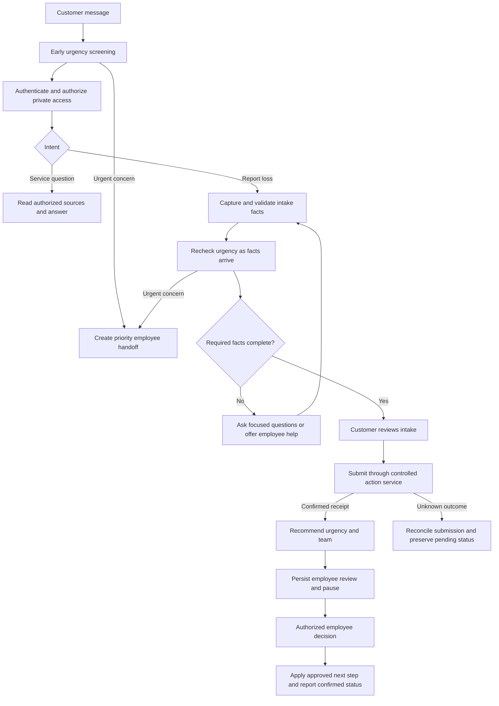
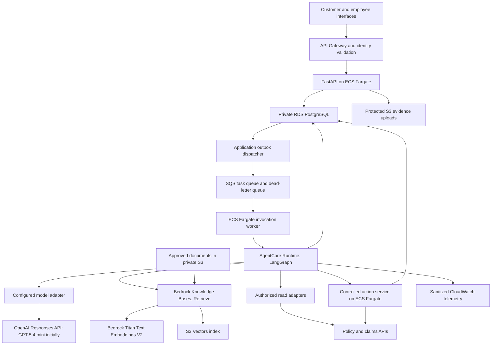

# Phase 1 Implementation Guide — Service, Claims Intake, and Triage on AWS

**Status:** Milestone 1A local journey implemented and browser verified, including provider adapter, configurable sources/teams, pre-auth help, SQLite checkpoints and review interrupts. Live model evaluation awaits credentials; AWS, Bedrock RAG, protected evidence and later milestones remain pending. See [implementation status](PHASE_1_STATUS.md).
**Updated:** September 13, 2026.  
**Scope:** Customer service with bounded RAG, claims intake, and human-reviewed claims triage using LangGraph on AWS.

This guide defines the first delivery increment of the [Strategy](STRATEGY.md). It specializes the [Architecture](ARCHITECTURE.md) and [Deployment topology](DEPLOYMENT_TOPOLOGY.md) for AWS. Where those documents describe broader enterprise capabilities, this guide controls phase-one scope and sequencing.

## 1. Outcome and scope

Deliver an authenticated customer journey that answers approved service questions, captures a first notice of loss (FNOL), submits validated intake to a claims API, recommends urgency and a handling team, and preserves context for an employee handoff. Deploy and verify the journey in AWS development and staging before a controlled production pilot.

Implement an auto loss journey first. Add property intake and its distinct urgency rules after the auto journey passes the end-to-end gate. Auto is the initial implementation choice, not a restriction on the shared domain model. A first auto pilot can proceed before property expansion when its own launch criteria pass.

| Capability | Phase-one behavior | Authority boundary |
|---|---|---|
| Customer service | Approved process answers, authorized policy summaries and claim status, next-step explanations, employee handoff | No coverage determination, cancellation, policy amendment, or payment promises |
| Claims intake | Structured facts, missing-field questions, protected evidence uploads, customer confirmation, validated submission | No invented facts; a saved draft is not a submitted claim |
| Claims triage | Recommend urgency, handling team, specialist attention, and missing information with evidence | No fraud verdict, denial, settlement, or autonomous claim assignment |
| Employee review | Accept, amend, or reject triage recommendations; request more information | Authenticated reviewer with scoped authority and an audit record |

Fraud analysis is deferred. Conflicting facts trigger clarification or employee review; they do not establish fraud or automatically block assistance. Also defer cross-sell, quotes, underwriting, payments, Azure/GCP deployment, A2A integration, autonomous routing, and portfolio-scale rollout.

The pilot uses one customer web channel and a minimal employee review interface or an existing work-queue integration. Voice and unrestricted document interpretation are later increments. Phase one supports evidence uploads and references; any model-based extraction requires its own evaluated scope before activation.

## 2. Workflow and agent responsibilities

Use a Python LangGraph coordinator with service, intake, and triage nodes or subgraphs. Deterministic code owns transitions, permissions, validation, and action eligibility. Use the model for intent interpretation, structured fact extraction, approved-source answers, and evidence-grounded recommendations.



Urgent help must not depend on complete intake or a successful claim submission. Early screening uses the current message and approved guidance without accessing private records. A pre-authentication handoff carries only permitted current-session information; policy and claim access still require authorization. Deduplicate escalations and attach the claim reference later when available.

Injury reports, undrivable vehicles, and uninhabitable homes are examples for claims owners to turn into explicit rules. They are not final production priority definitions. Treat unknown injury or habitability status as unknown and ask or escalate. Approved rules establish minimum urgency; an LLM cannot downgrade it. Recheck on each material update, including while awaiting review.

### Service agent

- Retrieve status through authorized policy/claims adapters and process guidance from a small, versioned approved content set.
- Distinguish policy facts from a coverage decision; identify unavailable or outdated source data.
- Preserve collected facts when moving to intake or an employee.
- Offer employee help when requested, when information is unsupported, or when tools fail.

### Phase-one RAG

Use Amazon Bedrock Knowledge Bases with an S3 Vectors index for a small, curated set of approved FAQs, claims procedures, and intake checklists. Begin with auto content. This is a planned selection; no buckets, indexes, or embeddings have been deployed. AWS supports using S3 Vectors as the Knowledge Bases vector store. [AWS integration documentation](https://docs.aws.amazon.com/AmazonS3/latest/userguide/s3-vectors-getting-started.html)

| Data | Planned location |
|---|---|
| Approved original documents and metadata | Versioned, private general-purpose S3 knowledge bucket |
| Embeddings, vector keys, and retrieval metadata | Separate S3 vector bucket and index per environment |
| Customer evidence uploads | Existing protected S3 evidence bucket; excluded from this knowledge corpus |
| Workflow state and business records | Existing RDS PostgreSQL schemas |

Ingestion: approved S3 documents → Knowledge Bases parsing/chunking → Bedrock Titan Text Embeddings V2 → S3 Vectors. Start with 1,024-dimensional embeddings and simple text documents; record the embedding model, dimension, chunking settings, and source version. Reindex when the model or chunking configuration changes.

Retrieval: the service node calls Knowledge Bases `Retrieve`, then passes relevant passages and source references to the configured generation adapter (initially GPT-5.4 mini through OpenAI). Validate and render citations to the approved source version. Do not add a second generation call merely to use RAG. Keep source access behind the application's authorization boundary. [AWS retrieval documentation](https://docs.aws.amazon.com/bedrock/latest/userguide/kb-how-retrieval.html)

Apply backend-controlled filters for approved status, line of business, jurisdiction where relevant, and effective version. Keep customer-facing guidance separate from employee-only material; metadata supplied by a user or model is not an authorization decision. Treat retrieved text as evidence, never executable instructions. Reject unsupported answers and offer employee help when sources are missing, stale, contradictory, or insufficient. Continue to obtain live policy and claim facts through authorized APIs, and make no coverage decisions through RAG.

Evaluate relevant-source retrieval, citation correctness, supported answers, no-answer cases, source withdrawal, access boundaries, and latency before pilot launch. Verify S3 Vectors metadata limits, region/provider support, and semantic-search quality during the deployment spike. Broader ingestion, complex policy/endorsement interpretation, multimodal parsing, and advanced retrieval are phase-two work. The [AWS cost estimate](PHASE_1_AWS_COST_ESTIMATE.md) includes vector storage, embedding generation, and retrieval usage.

### Intake agent

- Start with an authorized policy reference, incident date/time and timezone where known, loss description, protected location reference, affected vehicle/property reference, and contact preference/reference.
- For auto, collect reported injury status and drivability. For property, collect habitability and ongoing hazard information using approved questions.
- Represent each material fact with its source and confirmation status; keep missing and conflicting facts explicit.
- Apply line-specific required-field rules. Do not require every attachment before reporting a loss unless the approved intake contract requires it.
- Present the proposed intake for customer confirmation before submission. Material edits invalidate earlier confirmation.
- Submit through a validated action service and retain the authoritative receipt. Map an intake receipt and a claim number separately when the core system creates them at different times.

### Triage agent

Return a validated object containing `priority`, `recommended_team`, `reason_codes`, `evidence_refs`, `missing_fields`, `rule_version`, and `review_required`. Team and reason values must come from approved catalogs. Do not introduce a fraud score.

All phase-one triage recommendations require employee review. Urgency alerts can enter a priority review queue immediately under approved rules; that is distinct from assigning a claim to a handling team. The customer sees that review is pending until the relevant system confirms the next action.

## 3. State, APIs, and business writes

### Authoritative state

| Store | Responsibility |
|---|---|
| LangGraph checkpoints | Workflow position, minimized facts/references, pending input and review references, workflow/schema versions |
| Application PostgreSQL tables | Conversation ownership, durable tasks, review decisions, action ledger, delivery outbox, concurrency versions |
| Claims system | Submitted intake, claim reference, actual assignment, authoritative claim status |
| Protected S3 evidence storage | Uploaded evidence and metadata with object-level access and retention |

Start with one RDS PostgreSQL deployment and separate schemas/permissions for application records and graph checkpoints. The database is not a replacement claims system. Use synthetic policy/claims fixtures behind the same API contracts in development; connect to an approved claims sandbox for staging integration validation.

Graph state should include `schema_version`, `workflow_version`, `conversation_ref`, `intake_ref`, optional `claim_ref`, `line_of_business`, confirmed fact references, `missing_fields`, `evidence_refs`, `urgency`, `triage`, `pending_review_ref`, `pending_action_ref`, and `state_version`. Avoid copying complete transcripts or evidence files into state.

Credentials, authorization tokens, raw identity documents, and payment data stay outside graph state and model-generated fields. Resolve customer ownership from trusted request context. A conversation ID or LangGraph thread ID is a lookup key, not proof of authorization.

### Application contracts to implement

| Endpoint | Behavior |
|---|---|
| `POST /v1/conversations` | Create an authenticated customer-scoped conversation |
| `POST /v1/conversations/{id}/messages` | Validate ownership and message ID; persist accepted work; return a task reference |
| `GET /v1/tasks/{id}` | Return authorized task status and customer-safe results |
| `POST /v1/conversations/{id}/evidence-uploads` | Authorize evidence attachment and issue a constrained upload request |
| `POST /v1/conversations/{id}/intake-confirmations` | Confirm the exact validated draft version for submission |
| `GET /v1/reviews` | Return only employee-authorized review items |
| `POST /v1/reviews/{id}/decision` | Record an authorized, version-checked accept/amend/reject/request-information decision |

Use `202 Accepted` for queued work, with distinct running, awaiting-customer, awaiting-review, completed, and failed task states. A completed service task does not imply a claim has been submitted. Define schemas and error codes before graph implementation.

### Safe submission and recovery

1. The action service validates customer/object access, allowed operation, input schema, and confirmation or employee decision against the current draft/state version.
2. Persist an action ID, stable operation idempotency key, payload hash, and pending status before the external write. The key remains stable across retries of the same logical action.
3. Call the claims API using its idempotency mechanism and store the returned receipt.
4. If a timeout leaves the result unknown, look up the action by its external correlation key before retrying. An application ledger alone cannot guarantee deduplication in the core system.
5. If the core API provides neither idempotency nor reconciliation lookup, send uncertain outcomes to an employee and block automatic resubmission.
6. Return submitted or assigned status only from confirmed system results. Keep unresolved outcomes visibly pending.

Persist tasks and an outbox entry in one application transaction before acknowledging queued work. An outbox dispatcher publishes task references to SQS. Workers tolerate duplicate delivery, serialize execution per workflow using a lease with fencing/version checks, and persist completion before acknowledging the message. Use bounded retries and a monitored dead-letter queue.

LangGraph checkpoints and business writes are separate commits. Reconcile using durable action IDs when a restart occurs between them. Avoid external side effects inside replayable model nodes.

## 4. LangGraph implementation

Create typed state and validated request/result models, then implement explicit nodes for authorization context binding, intent routing, urgency rules, service retrieval, intake extraction, missing-field handling, customer confirmation, action submission, triage, employee review, and response generation. Authorization enforcement also remains in the API and tool/action backends.

Use a persistent PostgreSQL checkpointer in AWS. LangGraph supports checkpointed state for conversation continuity and recovery; in-memory checkpointing does not survive process restarts. [LangGraph persistence](https://docs.langchain.com/oss/python/langgraph/persistence)

Use `interrupt()` to pause for employee review and resume with `Command(resume=...)` on the same authorized thread. An interrupted node restarts from its beginning on resume, so create review tasks idempotently in a preceding step and keep replayable code free of unprotected writes. The application owns review deadlines, notifications, authorization, and stale-decision rejection. [LangGraph interrupts](https://docs.langchain.com/oss/python/langgraph/interrupts)

Bind an authenticated review decision to the review ID, proposed action, evidence/draft version, and reviewer identity. Reject stale approvals and re-evaluate changed facts. Accept, amend, reject, and request-information branches must all terminate in a defined state; rejection must not silently execute the original proposal. Customer text cannot resume an employee-only approval.

Begin with one graph runtime for the three roles. Tool lists restrict model exposure, but do not provide strong identity isolation inside a shared process. Keep write credentials in a separately authorized action service. Backend policy derives permitted operations from trusted workflow/task records and caller authority, never from an LLM-supplied role. Split specialist runtimes later if stronger role isolation is required.

Use typed internal HTTP tools initially. MCP can wrap the same contracts when needed; it is not a prerequisite for this release. Pin and lock tested versions of Python dependencies, LangGraph/checkpointer packages, the model adapter, and the AgentCore SDK. Record model, prompt, graph, schema, and rule versions with each evaluated release.

## 5. AWS implementation topology



This is the proposed placement, not a deployed configuration. API, workers, and action service can share source packages while using separate workload identities. Human pauses persist in storage and release the invocation; they do not require holding a runtime session or queue message open.

| Concern | Phase-one selection and implementation requirement |
|---|---|
| Agent hosting | AgentCore Runtime with an AWS-specific invocation adapter; LangGraph owns orchestration |
| Model | Initially GPT-5.4 mini through OpenAI Responses API; configurable provider adapter and evaluated replacements per [ADR 0001](adr/0001_model_selection_and_provider_abstraction.md) |
| Public API | API Gateway with authenticated access to private FastAPI hosting; select and validate the gateway/private integration pattern |
| Identity | Existing identity provider or Cognito; distinct customer and employee scopes, IAM roles for workloads |
| Network | Private database and application services; validate AgentCore access to RDS, internal tools, enterprise APIs, and outbound HTTPS to the OpenAI API |
| Evidence | Private S3 bucket, encryption, limited upload size/type, quarantine and malware scanning before downstream use |
| RAG | Approved documents in a separate private S3 bucket; Bedrock Knowledge Bases with Titan Text Embeddings V2 and S3 Vectors; versioned citations and evaluated fallback |
| Secrets and keys | Secrets Manager and KMS; runtime retrieval with least privilege |
| Artifacts | ECR images pinned by digest and versioned prompt/rule bundles |
| Operations | CloudWatch metrics and sanitized logs, restricted action audit, alarms with named owners |
| Infrastructure | Terraform with separate AWS environment roots and encrypted remote state with locking |

AgentCore supports LangGraph hosting. Implement its documented HTTP runtime contract through an adapter rather than exposing application routes directly as runtime routes. Validate entrypoint, health checks, invocation envelope, authentication, container architecture, session mapping, and networking with a deployed spike. AgentCore session facilities do not replace application task records or LangGraph checkpoint configuration. [AWS runtime overview](https://docs.aws.amazon.com/bedrock-agentcore/latest/devguide/agents-tools-runtime.html), [runtime service contract](https://docs.aws.amazon.com/bedrock-agentcore/latest/devguide/runtime-service-contract.html)

Use separate development, staging, and production environment identities, data, secrets, and Terraform state. Begin in one selected primary region; document and test the recovery approach required for the pilot's agreed RTO/RPO. Production storage and compute redundancy must match those objectives. Size from measured pilot demand and burst tests, not the 40-million-policy planning envelope.

## 6. Repository structure to create

The [Phase 1 AWS cost estimate](PHASE_1_AWS_COST_ESTIMATE.md) prices this topology for a small development environment and a more resilient pilot, with separate fixed and usage costs. It is a planning estimate, not a deployed bill or capacity guarantee.

The following is the target structure. Domain, contracts, local API/web/worker/action
modules, synthetic insurance adapter, workflows, and unit/integration tests exist.
Cloud, model agents, evidence, evaluations, and deployment paths remain planned:

```text
src/
  apps/
    api/                     # Customer and employee HTTP contracts
    web/                     # Minimal customer and employee interfaces
    worker/                  # Outbox dispatch and runtime invocation
    action_service/          # Validated business writes and reconciliation
  insurance_domain/        # Intake schemas, approved rules, reason catalogs
  workflows/               # LangGraph coordinator and checkpoints
  agents/{service,intake,triage}/
  contracts/               # API and tool request/result schemas
  adapters/aws/            # Bedrock, AgentCore, storage and messaging adapters
  adapters/insurance/      # Mock, sandbox, and production core API adapters
policies/                  # Versioned urgency, field and authorization rules
evals/synthetic_cases/     # Auto first, then property
tests/{unit,contract,integration}/
infra/bootstrap/aws/
infra/modules/aws/
infra/environments/aws/{dev,stage,prod}/
deploy/aws/                # Runtime adapter configuration and release runbooks
.github/workflows/         # CI and AWS deployment pipeline
```

Brace notation abbreviates separate directories. Keep source modules small enough to run together locally while preserving explicit contracts and permission boundaries. Do not scaffold unused cloud implementations as a phase-one dependency.

## 7. Implementation milestones

| Milestone | Work | Completion evidence |
|---|---|---|
| 1A: Contracts and local auto journey | Define facts, rules, APIs, fixtures, graph transitions, customer confirmation, action ledger, and employee review; build minimal interfaces | Synthetic auto journey reaches a confirmed mock receipt and reviewed next step; service lookup and incomplete-intake paths work |
| 1B: AWS deployment spike | Terraform development foundation; deploy API, worker, AgentCore graph, Bedrock access, persistent checkpoints, and a small S3 Vectors knowledge base | Authenticated queued invocation works; runtime reaches private dependencies; resume succeeds after restart; approved documents ingest and retrieve with source references |
| 1C: Integrated staging | Add evidence handling, real sandbox adapters, durable outbox/retries, review decisions, telemetry, and release automation | Sandbox claim receipt, duplicate protection, review handoff, access-denial checks, and recovery tests pass |
| 1D: Controlled auto pilot | Complete launch decisions, production configuration, operational rehearsal, and limited cohort rollout | Business owner accepts evaluation results; employee queue is staffed; measured pilot quality, cost, and recovery meet agreed targets |
| 1E: Property expansion | Add property schema, habitability/urgency rules, fixtures, and reviewer routing | Property-specific quality and urgent-case gates pass before enabling property traffic |

Use 1B early to uncover runtime and network constraints before completing all features. Each milestone should produce a reproducible demonstration and recorded verification results. Dates and resource estimates depend on core API access and team availability and are not asserted here.

## 8. Evaluation and phase-one acceptance

| Area | Required cases | Pass evidence |
|---|---|---|
| Service | Valid status lookup, unavailable source, unsupported coverage question | Correct source-backed response or employee fallback; no invented status or coverage decision |
| RAG | Relevant and irrelevant documents, missing answer, stale/withdrawn source, conflicting guidance, unauthorized content, injected source instructions | Appropriate approved passages retrieved; citations match source versions and support answers; insufficient evidence leads to fallback; access restrictions hold |
| Intake | Complete auto report, unknown injury status, conflicting date, abandoned/resumed draft | Required-field rules enforced; unknown remains unknown; customer confirms current draft |
| Urgency | Injury reported early, later drivability change, property habitability concern | Approved minimum urgency preserved; handoff does not wait for complete intake; new facts invalidate stale review |
| Triage | Routine, urgent, ambiguous, conflicting evidence | Valid team/reason catalogs, traceable evidence, employee review; no fraud conclusion |
| Identity | Another customer's policy/claim/task/evidence ID, forged thread, customer calling review API | Denied without leaking private content or performing a write |
| Injection and privacy | Malicious source text, accidental sensitive-data paste, unsafe attachment | No permission expansion; protected upload path; sanitized model input, outputs, logs and traces checked |
| Business writes | Duplicate message, retry after external success, timeout before receipt, restart before checkpoint | One confirmed logical submission or an explicit unresolved outcome for reconciliation |
| Human review | Restart during pause, stale approval, duplicate decision, amendment, rejection, overdue review | Authorized version-checked transition; no unapproved action; overdue work escalates |
| Infrastructure | Model throttling, core API outage, worker failure, queue backlog, database restore | Bounded retries, monitored failure queue, honest pending status, recovery within agreed objectives |

For the defined release fixtures, require every expected access denial to hold, no duplicate writes in replay tests, no missed explicit urgent triggers, and successful restore/resume demonstrations. These are test gates, not claims of perfect real-world safety or portfolio capacity.

Claims and quality owners must set numerical thresholds for intake accuracy, urgent-case recall on a broader labeled evaluation set, inappropriate escalation, triage agreement/overrides, handoff completion, and unsupported statements. Operations and product owners set latency, backlog age, recovery, and cost-per-completed-journey targets. Record denominators, sample sizes, failure examples, and approval before pilot launch.

Measure customer completion and repeat contacts alongside employee workload; do not optimize containment alone. Break down results by line, scenario severity, and model/prompt/rule version. Evaluate realistic bursts within the pilot envelope and verify that priority handoffs retain capacity.

## 9. Release and operating procedure

1. Run contract, deterministic rule, security, and recovery tests plus the versioned synthetic model evaluation suite.
2. Build and scan artifacts; record image digest, dependency lockfiles, and graph/model/prompt/rule versions.
3. Authenticate CI with AWS federation/OIDC and an environment-scoped deployment role.
4. Validate Terraform and review the concrete plan; keep secret values out of repository files and plan outputs. Verify provider coverage against the pinned version and document any separate SDK-owned publication steps.
5. Deploy to development, then staging; run deployed authentication, invocation, checkpoint, evidence, and claims sandbox checks.
6. Promote the approved release to a limited production cohort after the pilot gates pass. Route unsupported cases to staffed employees.
7. Monitor urgent queue age, failures, unsupported answers, duplicate actions, latency, model usage, and per-journey cost.
8. On regression, disable new AI intake or route new work to employees while preserving accepted tasks and pending reviews. Roll back compatible application artifacts; do not blindly replay or roll back claims records.

The on-call runbook must cover claims API outages, uncertain submissions, stuck reviews, poisoned queue messages, model quota exhaustion, credential failures, evidence incidents, and database recovery. Name an owner and escalation destination for each; an unmonitored queue is not a completed employee handoff.

## 10. Decisions required before pilot launch

| Decision | Accountable owner | Needed by |
|---|---|---|
| AWS account/region, model and quotas, network/private integration | Platform and security | Deployment spike |
| Core API schemas, identity delegation, idempotency and reconciliation support | Claims integration team | Integrated staging |
| Required intake fields, urgency rules, handling teams and customer wording | Claims product owner | Local journey; approved versions before pilot |
| Customer identity and employee reviewer roles | Identity/security team | Integrated staging |
| Employee queue, staffing, due times and escalation | Claims operations | Integrated staging; staffed before pilot |
| Evidence handling, sensitive-data controls, retention and deletion | Privacy/security and records owners | Integrated staging |
| Pilot cohort, quantitative quality/cost gates and rollout limits | Product and quality owners | Pilot launch |
| RTO/RPO, backup/restore evidence and incident ownership | Operations and business owner | Pilot launch |

Local development can proceed with explicit synthetic assumptions. Production readiness requires these decisions and measured evidence; this guide does not authorize cloud provisioning or claim that infrastructure has been deployed.
