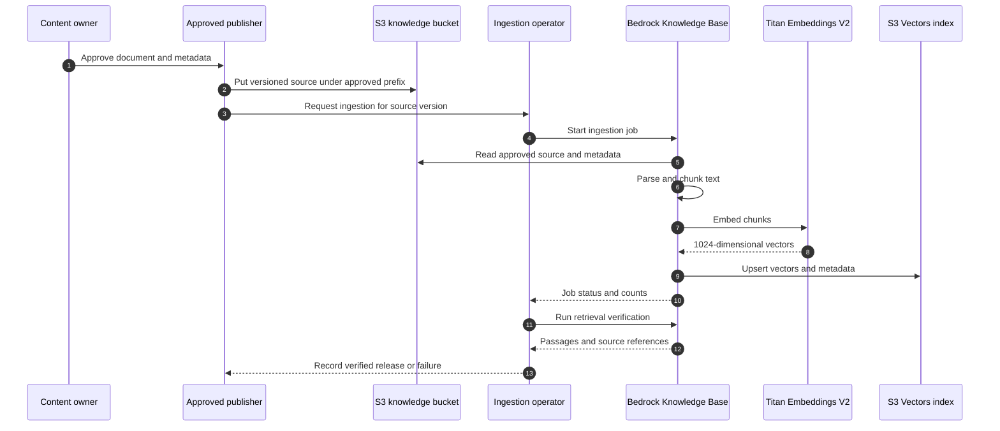
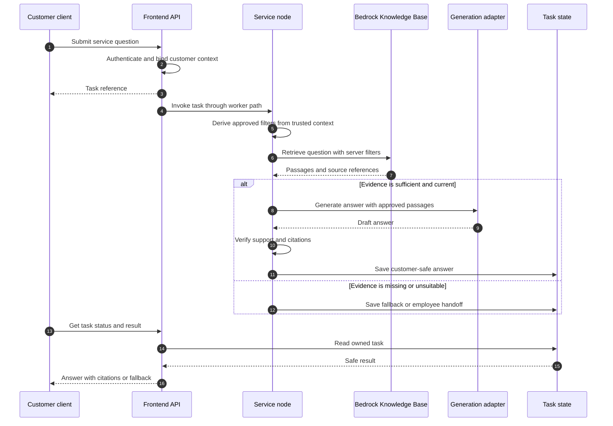
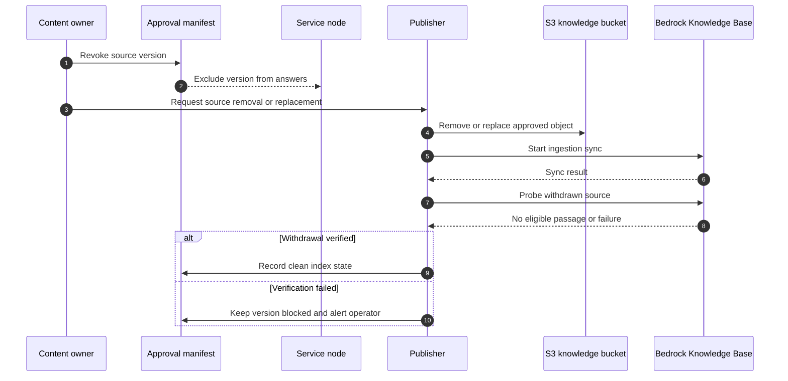

# RAG deployment topology

**Status:** Proposed phase-one AWS design. Development Terraform resources are defined and mock validated; no account-backed apply, ingestion, or live retrieval has run.
**Updated:** September 17, 2026.

This document covers deployment and operation of the bounded customer-service knowledge corpus. The [platform deployment topology](DEPLOYMENT_TOPOLOGY.md) owns shared runtime, network, release, and recovery boundaries. The [Phase 1 guide](PHASE_1_IMPLEMENTATION_GUIDE.md#phase-one-rag) owns answer behavior and evaluation criteria. This document specifies how approved material reaches retrieval and how the service consumes it. Azure and GCP RAG implementations have not been selected.

## Placement and ownership

| Component | Phase-one AWS placement | Owner and boundary |
|---|---|---|
| Approved source documents | Private, versioned general-purpose S3 knowledge bucket, `approved/` prefix | Content publisher after business approval |
| Parsing and chunking | Bedrock Knowledge Bases S3 data source; fixed 300-token chunks with 15% overlap in current Terraform | Knowledge Base ingestion job |
| Embeddings | Titan Text Embeddings V2, 1,024 dimensions | Knowledge Base service role |
| Vector search | Separate S3 Vectors bucket and index | Knowledge Base service role; queried via `Retrieve` |
| Retrieval caller | Service node in the coordinator runtime | Runtime identity scoped to the Knowledge Base |
| Answer generation | Configured model adapter, initially OpenAI GPT-5.4 mini | Runtime outbound model call; retrieved passages are input context |
| Customer evidence | Separate protected evidence storage | Excluded from the shared knowledge data source |
| Task and workflow state | Application database and LangGraph checkpoint store | Excluded from the knowledge corpus |

The current Terraform defines the development knowledge bucket, vector bucket/index, Knowledge Base, data source, and IAM roles. It does not define a content approval/publishing pipeline, scheduled ingestion, source withdrawal workflow, or production deployment. The local service currently uses a versioned source catalog; the live Knowledge Base retrieval adapter remains deployment work. See [development Bedrock setup](BEDROCK_DEVELOPMENT.md) and [implementation status](PHASE_1_STATUS.md).

## Publish and ingest

Only a trusted publisher may place reviewed documents and their retrieval metadata under `approved/`. Record a stable document ID, source version, line of business, audience, jurisdiction when relevant, approval status, and effective dates in a governed manifest. Map the fields needed for server-side filtering into Knowledge Base metadata; verify their supported types and filter behavior in the live spike. S3 object versioning preserves originals, but a new object version is not proof that the vector index has synchronized.

Publishing and ingestion are separate steps. Mark a source version available for customer answers only after ingestion finishes and retrieval checks confirm its citation and access metadata. Keep the previous verified release available until the replacement passes those checks. The specific release manifest and automation are to be implemented; Terraform currently supplies the infrastructure only.

## Customer retrieval

The customer never calls the Knowledge Base directly. The API authenticates and binds customer ownership; the service node derives allowed retrieval filters from server-owned context. User text and model output cannot grant access to an audience, jurisdiction, or line of business. Live policy and claim facts still come from authorized enterprise APIs, not from RAG.

The diagram abbreviates the existing durable outbox and worker path; the [platform topology](DEPLOYMENT_TOPOLOGY.md#async-request-and-response-path) describes it. `Retrieve` supplies passages; generation remains one call through the configured adapter. Persist only the source identifiers, versions, and safe answer data required for audit under the agreed retention policy. Keep raw customer queries and retrieved passages out of unrestricted logs.

## Withdrawal, updates, and recovery

An expired, revoked, or superseded document needs an explicit withdrawal process. Block its version at the application approval layer immediately, then remove or replace the source object and synchronize the Knowledge Base. Verify that search no longer returns the withdrawn version before considering the index clean. A failed or delayed synchronization must leave the version blocked from answers. Rebuild the index and re-evaluate retrieval when embedding model, dimension, or chunking settings change.

The approval manifest and runtime block are proposed controls, not implemented integrations. They are needed because S3 version history, Knowledge Base ingestion, and customer retrieval are separate states. For recovery, restore the approved source set and its manifest, rebuild or restore the vector index in the selected region, then run source, citation, filter, and withdrawal probes before resuming customer RAG. Recovered workflow checkpoints must not imply that the knowledge index is current. Regional quotas, model availability, and recovery time objectives remain deployment decisions.

## Identity, observability, and release gates

- Give the content publisher write access only to the approved source location; do not give it runtime or customer evidence permissions.
- Give the Knowledge Base role read access to the approved S3 prefix, embedding invocation, and its S3 Vectors index. The current development Terraform scopes these grants; validate them in an account-backed plan and live test.
- Give the service runtime `bedrock:Retrieve` on the selected Knowledge Base. Keep the browser and general API routes without direct vector-store credentials.
- Separate development, staging, and production corpora, indices, identities, and ingestion jobs. Promote approved content and its metadata deliberately, then verify each environment independently.
- Record ingestion outcomes, source version, retrieval latency, empty-result rate, citation failures, and denied-filter tests. Alert on stale or failed ingestion and unexpected access; avoid logging full sensitive queries or passages.
- Before pilot use, prove approved-source retrieval, irrelevant-source rejection, customer versus employee access, effective-date and withdrawal behavior, citation accuracy, missing-evidence fallback, latency, and restore behavior with live AWS resources. The existing mocked Terraform tests do not establish these results.
