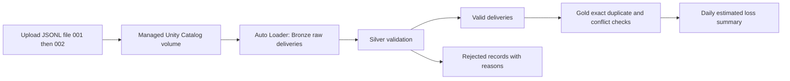

# Insurance POC: personal Databricks Free Edition walkthrough

Reviewed against [databricks_poc_plan.md](databricks_poc_plan.md).
This is its standalone Free Edition implementation: no AWS account, S3, IAM,
Terraform, credit card setup, or application deployment is needed.
The directory name `docs/aws` reflects the original plan, not a prerequisite.

Use **Free Edition**, rather than the separate timed free trial. Databricks
provides a workspace with default storage and serverless compute for personal
learning. [Official signup instructions](https://docs.databricks.com/aws/en/getting-started/free-edition).
Free Edition is quota limited and for non-commercial use; use only these synthetic
fixtures. If quota is exhausted, wait for it to reset.
[Free Edition limitations](https://docs.databricks.com/aws/en/getting-started/free-edition-limitations).

## 1. Understand what you will build



Review outcome: the original medallion design and acceptance totals are useful.
For simplicity this guide replaces its external volume with a managed volume and
its four schemas with one schema and layer-prefixed table names. It retains
incremental ingestion, decimal currency, rejected records, and duplicate checks.
Conflicting payloads for the same event ID fail the pipeline update. Estimates
are learning analytics; they do not approve payouts or change the insurance app.
This exercise does not demonstrate separate reader permissions or production isolation.

Files to use:

- [claim_events_001.jsonl](../../examples/databricks_poc/input/claim_events_001.jsonl): four records, including one negative estimate.
- [claim_events_002.jsonl](../../examples/databricks_poc/input/claim_events_002.jsonl): two new claims plus an exact duplicate of E001.
- [insurance_claims_pipeline.py](../../examples/databricks_poc/insurance_claims_pipeline.py): complete pipeline source.

The `.jsonl` inputs are newline-delimited JSON: one complete object per line,
without an enclosing array. Auto Loader still uses `cloudFiles.format = "json"`
with `multiLine` disabled (the default). All identities are synthetic. Keep the
two filenames unchanged.

## 2. Create your personal workspace

1. Follow the signup link in the official instructions above and choose Free Edition.
2. Sign up with your preferred method and open the workspace Databricks creates.
3. Open **Catalog** and note the default catalog name. The examples use `workspace`.
   If yours differs, substitute it in all SQL, pipeline settings and volume paths.
4. Create a Python notebook under **Workspace → Create → Notebook**, connect to
   **Serverless**, and use it for the setup and verification SQL below.
   Paste each SQL block into its own notebook cell with `%sql` as the first line.

## 3. Create a schema and managed upload volume

Run this in your setup notebook:

```sql
%sql
CREATE SCHEMA IF NOT EXISTS workspace.insurance_poc;
CREATE VOLUME IF NOT EXISTS workspace.insurance_poc.claim_files;
```

If `workspace` is unavailable, use an existing catalog where you can create a
schema. These commands use managed storage; no external location is needed.

In **Catalog**, expand your catalog → `insurance_poc` → **Volumes** → `claim_files`.
Use **Upload** / **Upload to volume** and upload **only** `claim_events_001.jsonl`
to the volume root. The path should be:

```text
/Volumes/workspace/insurance_poc/claim_files/claim_events_001.jsonl
```

Keep the Python source out of the input volume. Do not upload file 002 yet.
[Databricks volume file instructions](https://docs.databricks.com/aws/en/volumes/volume-files).

## 4. Add the Python source and create one pipeline

1. In **Workspace**, create a folder named `insurance_poc`.
2. Import `insurance_claims_pipeline.py` into that folder as a Python source file
   or Python notebook. If importing is unavailable, create a Python notebook and
   paste the entire source into one cell.
3. Open **Jobs & Pipelines** (some interfaces say **Workflows**), select
   **Create → ETL pipeline** / **Create pipeline**, and name it `insurance-free-poc`.
4. Choose a Lakeflow declarative ETL pipeline with **Serverless** compute and
   **Triggered** execution. Leave schedules disabled. Do not create a classic cluster.
5. Set the default catalog to `workspace` and default schema to `insurance_poc`.
   Use current/default publishing mode if shown; avoid legacy publishing mode.
6. Add the imported Python file/notebook as the pipeline source. If the editor
   creates a sample source, replace it with this source so only one definition
   of each dataset remains.
7. In pipeline settings, add the configuration key `insurance.input_path` with
   value `/Volumes/workspace/insurance_poc/claim_files`. Adjust the catalog if needed.
8. If an edition selector appears, select the edition supporting expectations
   (Advanced). Save the pipeline.

The Python file uses `pyspark.pipelines`, provided by Databricks. Do not install
the insurance application's dependencies or run this source with local Python.
Start it through the pipeline UI, rather than notebook **Run All**. Lakeflow
manages streaming checkpoints and schema state.
[Pipeline Python API](https://docs.databricks.com/aws/en/ldp/developer/python-ref).

## 5. Run file 001 and verify

Click **Start** / **Run pipeline**, wait for the update to succeed, and inspect
the graph. In the separate setup notebook, run:

```sql
%sql
SELECT 'bronze' AS layer, COUNT(*) AS records
FROM workspace.insurance_poc.bronze_claim_events_raw
UNION ALL
SELECT 'silver_valid', COUNT(*)
FROM workspace.insurance_poc.silver_claim_events_valid
UNION ALL
SELECT 'silver_rejected', COUNT(*)
FROM workspace.insurance_poc.silver_claim_events_rejected;
```

Expected: Bronze **4**, valid **3**, rejected **1**.

```sql
%sql
SELECT * FROM workspace.insurance_poc.gold_daily_claim_summary
ORDER BY incident_date, lob;
```

Expected: October 1 auto **2 / $1,500.00**, property **1 / $2,000.00**;
overall **3 claims / $3,500.00**.

```sql
%sql
SELECT event_id, estimated_loss_usd, rejection_reason, source_file
FROM workspace.insurance_poc.silver_claim_events_rejected;
```

Expected: E004, `-10.00`, reason `invalid_loss`. Raw values and file provenance
remain available. The pipeline's data-quality panel shows expectation metrics
for the classified valid/rejected branches; the rejected table is the source for
the rejection count and reasons.

## 6. Upload file 002 and run an incremental update

Upload `claim_events_002.jsonl` to the same volume root. Start the **same pipeline**
again with a normal update. Do not choose full refresh or reset checkpoints.
Run the same verification queries.

Expected counts: Bronze **7**, valid **6**, rejected **1**. Silver retains valid
duplicate deliveries; Gold deduplicates the original event payload, excluding
ingestion timestamps and filenames.

| Incident date | LOB | Unique claim count | Estimated loss USD |
| --- | --- | ---: | ---: |
| 2026-10-01 | auto | 2 | 1500.00 |
| 2026-10-01 | property | 1 | 2000.00 |
| 2026-10-02 | auto | 1 | 750.00 |
| 2026-10-02 | property | 1 | 1250.00 |
| Total | | 5 | 5500.00 |

Check the deduplication guard:

```sql
%sql
SELECT * FROM workspace.insurance_poc.gold_event_conflicts
WHERE payload_count <> 1;
```

Expected: no rows. The fixture has one distinct payload for each valid event ID.
Changing a payload while reusing an event ID violates the expectation and fails
the update. Do not consume results from a failed update as a successful refresh.

## 7. Verify replay and inspect lineage

1. Without uploading anything, start the same pipeline a third time.
2. Confirm counts remain **7 / 6 / 1**, and Gold remains **5 / $5,500.00**.
3. In the pipeline graph, inspect Bronze, both Silver tables and Gold.
4. In Catalog, open a Gold table and its **Lineage** tab to inspect dependencies.
5. Record the three update IDs and the query results for your POC evidence.

Auto Loader tracks processed files; immutable filenames and retained pipeline
state are necessary for this replay test. Triggered execution processes available
files and stops, so later uploads need another manual run.
[Pipeline execution modes](https://docs.databricks.com/aws/en/ldp/concepts/pipeline-mode).

## 8. Finish and troubleshoot

Leave scheduling disabled and close notebook sessions after the demo. Keep the
pipeline, volume and tables if you want to repeat queries. To remove the POC,
delete its pipeline in the UI first; then, only if all objects in `insurance_poc`
belong to this exercise, run `DROP SCHEMA workspace.insurance_poc CASCADE` in a
SQL cell. That permanently removes the POC tables and managed volume inputs.

| Symptom | Next step |
| --- | --- |
| Catalog or permission error | Use your existing writable catalog consistently in setup, settings, queries and input path. |
| Input path not found | Check the volume's copied path and upload location; avoid an extra nested folder. |
| Pipeline module/context error | Attach the source to the ETL pipeline and start a pipeline update. |
| Four records expected but seven appear | Both files were uploaded before run 1; start the staged exercise in a fresh dedicated schema/volume/pipeline. |
| Quota/compute unavailable | Check the Free Edition quota message and wait for reset; keep runs manual. |
| Gold update fails | Inspect the pipeline error and `gold_event_conflicts`; verify that duplicate event payloads are identical. |

The UI walkthrough above is one deployment option. Section 9 is an independent
from-scratch CLI path; completing sections 2–8 is not required.

## 9. Next: deploy with Databricks Asset Bundles without the workspace UI

This path starts with a new Free Edition signup and no POC schema, volume,
notebook or pipeline. DAB (now documented as Declarative Automation Bundles)
deploys the Python source and pipeline settings. General Databricks CLI commands
create the upload volume and transfer fixtures; the SQL API verifies results.
No earlier UI-created pipeline ID or bundle generation/binding is needed.

### 9.1. Register and obtain the workspace URL — browser required

Follow the [Free Edition signup instructions](https://docs.databricks.com/aws/en/getting-started/free-edition).
Register, complete any verification/terms, and open the workspace Databricks
provides. Copy its HTTPS URL, excluding page paths/query parameters.
This initial signup is a website step: `databricks bundle` cannot register an
account, accept subscription terms or provision the Free Edition workspace.
You do not need to create a notebook, volume or pipeline in the workspace UI.

Free Edition supplies managed storage and serverless compute. It has no
account-level APIs and limits active pipelines and SQL warehouses. If an earlier
POC still occupies the pipeline quota, retire it deliberately before starting this
independent exercise. Do not deploy a second pipeline over its existing tables.
[Free Edition limits](https://docs.databricks.com/aws/en/getting-started/free-edition-limitations).

### 9.2. Install the CLI and authenticate — browser login once

Install the current Go-based [Databricks CLI](https://docs.databricks.com/aws/en/dev-tools/cli/install)
for your operating system; the legacy Python `databricks-cli` package does not
support bundles. In a terminal:

```bash
databricks version
databricks auth login --host https://<your-workspace-host> --profile insurance-poc
databricks current-user me --profile insurance-poc
databricks catalogs list --profile insurance-poc
```

Replace the host placeholder first. OAuth opens a browser for sign-in/consent;
this is authentication, not UI-based resource deployment. Use a catalog where you
have `USE CATALOG` and `CREATE SCHEMA`; commands below assume `workspace`.
Substitute your actual catalog consistently if it differs.
For CI, use supported OAuth M2M or federation with a pre-provisioned identity;
Free Edition's account API limitations mean service-principal provisioning cannot
be assumed. [OAuth user login](https://docs.databricks.com/aws/en/dev-tools/auth/oauth-u2m).

### 9.3. Create a fresh schema and managed volume — general CLI

From the repository root, create a dedicated schema named `insurance_poc_cli`.
It deliberately differs from the UI walkthrough's `insurance_poc`.

```bash
databricks schemas create insurance_poc_cli workspace --profile insurance-poc
databricks volumes create workspace insurance_poc_cli claim_files MANAGED --profile insurance-poc
databricks fs ls dbfs:/Volumes/workspace/insurance_poc_cli/claim_files/ --profile insurance-poc
```

The listing must be empty before the first upload. If the schema already exists,
inspect it before continuing; an existing pipeline's tables/state are unsuitable
for the fresh acceptance test. Choose another fresh schema and update every path
below if necessary. Do not delete existing objects just to make these commands pass.

The operator owns the new schema/volume. The pipeline will run as its creator;
it needs parent usage, `READ VOLUME`, `CREATE TABLE` and
`CREATE MATERIALIZED VIEW`. Uploading also needs `WRITE VOLUME`.
If your identity lacks privileges, an authorized administrator must grant them
through SQL, the grants API/CLI or UI; bundle deployment does not bypass access control.
[Schema CLI](https://docs.databricks.com/aws/en/dev-tools/cli/reference/schemas-commands),
[Volume CLI](https://docs.databricks.com/aws/en/dev-tools/cli/reference/volumes-commands).

### 9.4. Prepare the local bundle directory

Continue from the repository root:

```bash
mkdir -p examples/databricks_poc/bundle/src
cp examples/databricks_poc/insurance_claims_pipeline.py examples/databricks_poc/bundle/src/
cd examples/databricks_poc/bundle
```

Create `databricks.yml` here with the following content, replacing the host:

```yaml
bundle:
  name: insurance-poc-cli

resources:
  pipelines:
    insurance_claims:
      name: insurance-free-poc-cli
      catalog: workspace
      schema: insurance_poc_cli
      serverless: true
      continuous: false
      development: false
      edition: ADVANCED
      configuration:
        insurance.input_path: /Volumes/workspace/insurance_poc_cli/claim_files
      libraries:
        - glob:
            include: ./src/insurance_claims_pipeline.py

targets:
  dev:
    default: true
    workspace:
      host: https://<your-workspace-host>
```

`insurance_claims` is the bundle resource key used by `bundle run`.
`schema` selects current publishing mode; do not add the legacy pipeline `target`
field. The bundle target named `dev` merely selects this environment: no bundle
`mode: development` overrides are enabled. There is no schedule, classic cluster
or custom checkpoint path. Advanced enables the source's expectations.
The explicit input configuration overrides the Python file's UI example default.
[Pipeline resource reference](https://docs.databricks.com/aws/en/dev-tools/bundles/resources#pipeline).

Commit YAML and source when reviewed; exclude `.databricks/` and credentials.
The source uses Databricks-provided `pyspark.pipelines`; no local Spark or
insurance application dependencies are needed. Repeat the copy after changing
the repository source, then redeploy; the bundle copy is what gets uploaded.

### 9.5. Validate and deploy a new pipeline — DAB CLI

From `examples/databricks_poc/bundle`:

```bash
databricks bundle validate -t dev --profile insurance-poc
databricks bundle deploy -t dev --profile insurance-poc
databricks bundle summary -t dev --profile insurance-poc
```

Resolve validation errors or unknown-property warnings before deployment; upgrade
the CLI if its schema does not recognize the current resource fields.
Deploy uploads the source and creates the pipeline; it does not run it or upload
JSONL inputs. Save the pipeline ID from the summary. There is no `generate` or
`deployment bind` step for this fresh deployment.
[Bundle commands](https://docs.databricks.com/aws/en/dev-tools/cli/bundle-commands).

### 9.6. Upload only file 001 and run the first update

Still in the bundle directory, fixture paths are relative to its parent:

```bash
databricks fs cp ../input/claim_events_001.jsonl dbfs:/Volumes/workspace/insurance_poc_cli/claim_files/claim_events_001.jsonl --profile insurance-poc
databricks bundle run insurance_claims -t dev --profile insurance-poc
```

Wait for success. Do not upload file 002 yet. Save the update ID and CLI output;
for further status/error details:

```bash
databricks pipelines get <pipeline-id> --profile insurance-poc
databricks pipelines list-updates <pipeline-id> --profile insurance-poc
databricks pipelines list-pipeline-events <pipeline-id> --profile insurance-poc
```

Replace `<pipeline-id>` with the ID from the bundle summary.
[Volume file CLI](https://docs.databricks.com/aws/en/dev-tools/cli/reference/fs-commands).

### 9.7. Verify through the SQL API — no notebook required

List the workspace's supplied SQL warehouse and copy its ID:

```bash
databricks warehouses list --profile insurance-poc
```

Your identity needs `CAN USE` on that warehouse. Use the supplied Free Edition
warehouse; do not create an additional one. If none is available, an administrator
must make supported SQL compute available (CLI/API or UI where permitted).
A warehouse is separate from the pipeline's serverless compute.

Create `verify-counts.json` in the bundle directory, substituting the warehouse ID:

```json
{
  "warehouse_id": "<warehouse-id>",
  "statement": "SELECT 'bronze' AS layer, COUNT(*) AS records FROM workspace.insurance_poc_cli.bronze_claim_events_raw UNION ALL SELECT 'silver_valid', COUNT(*) FROM workspace.insurance_poc_cli.silver_claim_events_valid UNION ALL SELECT 'silver_rejected', COUNT(*) FROM workspace.insurance_poc_cli.silver_claim_events_rejected",
  "wait_timeout": "50s",
  "on_wait_timeout": "CONTINUE"
}
```

Submit through the general CLI's API command:

```bash
databricks api post /api/2.0/sql/statements --json @verify-counts.json --profile insurance-poc
```

Only treat `status.state = SUCCEEDED` as a successful query. If pending/running,
copy `statement_id` from the response and poll:

```bash
databricks api get /api/2.0/sql/statements/<statement-id> --profile insurance-poc
```

Read `result.data_array`; this small query fits inline results. To verify Gold,
rejects and conflicts, replace `statement` in the JSON with each SQL query below
and submit again. Use plain SQL, without notebook `%sql` magic.

```sql
SELECT * FROM workspace.insurance_poc_cli.gold_daily_claim_summary
ORDER BY incident_date, lob;

SELECT SUM(claim_count) AS claims,
       SUM(total_estimated_loss_usd) AS loss_usd
FROM workspace.insurance_poc_cli.gold_daily_claim_summary;

SELECT event_id, estimated_loss_usd, rejection_reason, source_file
FROM workspace.insurance_poc_cli.silver_claim_events_rejected;

SELECT * FROM workspace.insurance_poc_cli.gold_event_conflicts
WHERE payload_count <> 1;
```

After run 1 expect **4 / 3 / 1** for Bronze/valid/rejected, Gold
**3 claims / $3,500**, E004 rejected with `invalid_loss`, and no conflicts.
[CLI API command](https://docs.databricks.com/aws/en/dev-tools/cli/reference/api-commands),
[SQL Statement Execution API](https://docs.databricks.com/api/workspace/statementexecution/executestatement).

### 9.8. Upload file 002, verify incremental ingestion, then replay

After the first checks pass:

```bash
databricks fs cp ../input/claim_events_002.jsonl dbfs:/Volumes/workspace/insurance_poc_cli/claim_files/claim_events_002.jsonl --profile insurance-poc
databricks bundle run insurance_claims -t dev --profile insurance-poc
```

Repeat section 9.7's queries. Expect **7 / 6 / 1**, Gold **5 claims / $5,500**,
E004 still rejected and no conflicts. Gold groups must be:

| Incident date | LOB | Claims | Loss USD |
| --- | --- | ---: | ---: |
| 2026-10-01 | auto | 2 | 1500.00 |
| 2026-10-01 | property | 1 | 2000.00 |
| 2026-10-02 | auto | 1 | 750.00 |
| 2026-10-02 | property | 1 | 1250.00 |

Without any upload, run `databricks bundle run insurance_claims -t dev --profile
insurance-poc` a third time and repeat the queries: all counts/totals must stay
unchanged. Save all three update IDs and query responses.
Do not overwrite inputs, full-refresh, reset checkpoints, change the bundle
identity/root or destroy/recreate the pipeline during these checks.

### 9.9. Make later changes and finish

For source/settings changes, keep bundle name, target and deployment root stable;
copy revised source into `src/`, then validate → deploy → run using section 9.5/9.6
commands. Upload only genuinely new immutable filenames for new deliveries.
Keep schedules disabled. If you started the SQL warehouse, stop it after queries
with `databricks warehouses stop <warehouse-id> --profile insurance-poc` when no
other work needs it. Free Edition quotas still apply to CLI execution.

Only when intentionally retiring this deployment, run `databricks bundle destroy
-t dev --profile insurance-poc`. This deletes the bundle-managed pipeline;
the separately created schema/volume and retained data require a separate cleanup
review. Inspect remaining objects before dropping the dedicated schema with
`CASCADE`; that permanently removes its tables and managed volume inputs.

### 9.10. What DAB cannot do, and what still needs the UI

“Outside DAB” does not automatically mean “UI required.” For this POC, signup
and interactive OAuth are the browser steps; resource deployment, uploads, runs
and SQL acceptance checks can then proceed from the terminal.

| Task | DAB `bundle` commands? | Required alternative / UI involvement |
| --- | --- | --- |
| Register, verify email, accept terms, obtain Free Edition workspace | No | Databricks signup website and initial workspace access required. |
| Interactive OAuth login/consent | No; general `auth login` starts it | Browser sign-in required for this user-login path. Supported pre-provisioned machine authentication can avoid it for CI. |
| Deploy Python source and create/update/run pipeline | Yes | No workspace UI required. |
| Create catalog/schema/volume definitions | Supported by current bundles, subject to version/permissions | This guide uses general catalog/schema/volume CLI commands for setup; UI is optional. These are not inherently UI-only resources. |
| Upload fixture contents into a UC volume | Not automatically through this bundle's deploy | General `databricks fs cp`; UI optional. |
| Execute acceptance SQL and inspect query results | No direct acceptance-query execution in this pipeline bundle | Statement Execution API through `databricks api`; UI optional. |
| Grant missing privileges or establish identities | Deployment cannot grant authority the caller lacks | Authorized admin uses SQL/CLI/API/Terraform or UI; Free Edition account-level APIs are unavailable. |
| Render the pipeline DAG/data-quality panels and Catalog Lineage tab | No visual renderer in bundle CLI | Use workspace Jobs & Pipelines / Catalog UI for these visual screenshots. CLI events/SQL provide programmatic evidence; screenshots are an optional remaining UI step. |
| Provision AWS S3/IAM/VPC or a Databricks account/workspace | Outside this pipeline bundle | AWS CLI/Terraform and authorized Databricks account APIs/Terraform for eligible AWS accounts. Free Edition workspace signup remains the website path. |
| Increase Free Edition quotas or enable unavailable account features | No | UI cannot bypass these limits either; wait for quota reset or use an eligible paid/trial offering. |

To capture the visual evidence from the original plan, open the deployed pipeline
in **Jobs & Pipelines** for its graph/quality panels, then open a Gold table in
**Catalog → Lineage**. These views require the workspace UI; they are not needed
to create or execute the pipeline. This CLI path verifies data/replay behavior,
not the plan's separate analytics-reader permission isolation.
For the AWS stage, Terraform should own S3/IAM and UC infrastructure while DAB
owns pipeline code/settings. A single resource must not be managed by both.
[Current supported bundle resources](https://docs.databricks.com/aws/en/dev-tools/bundles/resources).
