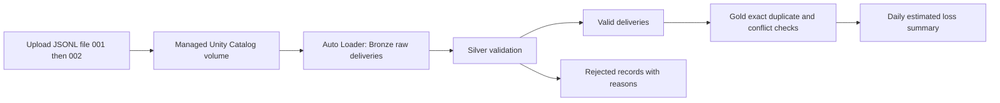

# Insurance POC: personal Databricks Free Edition walkthrough

Reviewed against [databricks_poc_plan.md](databricks_poc_plan.md).
This is its standalone Free Edition implementation: no AWS account, S3, IAM,
Terraform, credit card setup, or application deployment is needed.
The directory name `docs/aws` reflects the original plan, not a prerequisite.

Use **Free Edition**, rather than the separate timed free trial. Databricks
provides a workspace with default storage and serverless compute for personal
learning. [Official signup instructions](https://docs.databricks.com/aws/en/getting-started/free-edition).
Free Edition is quota limited and for non-commercial use; use only these synthetic
fixtures. If quota is exhausted, wait for it to reset.
[Free Edition limitations](https://docs.databricks.com/aws/en/getting-started/free-edition-limitations).

## 1. Understand what you will build



Review outcome: the original medallion design and acceptance totals are useful.
For simplicity this guide replaces its external volume with a managed volume and
its four schemas with one schema and layer-prefixed table names. It retains
incremental ingestion, decimal currency, rejected records, and duplicate checks.
Conflicting payloads for the same event ID fail the pipeline update. Estimates
are learning analytics; they do not approve payouts or change the insurance app.
This exercise does not demonstrate separate reader permissions or production isolation.

Files to use:

- [claim_events_001.jsonl](../../examples/databricks_poc/input/claim_events_001.jsonl): four records, including one negative estimate.
- [claim_events_002.jsonl](../../examples/databricks_poc/input/claim_events_002.jsonl): two new claims plus an exact duplicate of E001.
- [insurance_claims_pipeline.py](../../examples/databricks_poc/insurance_claims_pipeline.py): complete pipeline source.

The `.jsonl` inputs are newline-delimited JSON: one complete object per line,
without an enclosing array. Auto Loader still uses `cloudFiles.format = "json"`
with `multiLine` disabled (the default). All identities are synthetic. Keep the
two filenames unchanged.

## 2. Create your personal workspace

1. Follow the signup link in the official instructions above and choose Free Edition.
2. Sign up with your preferred method and open the workspace Databricks creates.
3. Open **Catalog** and note the default catalog name. The examples use `workspace`.
   If yours differs, substitute it in all SQL, pipeline settings and volume paths.
4. Create a Python notebook under **Workspace → Create → Notebook**, connect to
   **Serverless**, and use it for the setup and verification SQL below.
   Paste each SQL block into its own notebook cell with `%sql` as the first line.

## 3. Create a schema and managed upload volume

Run this in your setup notebook:

```sql
%sql
CREATE SCHEMA IF NOT EXISTS workspace.insurance_poc;
CREATE VOLUME IF NOT EXISTS workspace.insurance_poc.claim_files;
```

If `workspace` is unavailable, use an existing catalog where you can create a
schema. These commands use managed storage; no external location is needed.

In **Catalog**, expand your catalog → `insurance_poc` → **Volumes** → `claim_files`.
Use **Upload** / **Upload to volume** and upload **only** `claim_events_001.jsonl`
to the volume root. The path should be:

```text
/Volumes/workspace/insurance_poc/claim_files/claim_events_001.jsonl
```

Keep the Python source out of the input volume. Do not upload file 002 yet.
[Databricks volume file instructions](https://docs.databricks.com/aws/en/volumes/volume-files).

## 4. Add the Python source and create one pipeline

1. In **Workspace**, create a folder named `insurance_poc`.
2. Import `insurance_claims_pipeline.py` into that folder as a Python source file
   or Python notebook. If importing is unavailable, create a Python notebook and
   paste the entire source into one cell.
3. Open **Jobs & Pipelines** (some interfaces say **Workflows**), select
   **Create → ETL pipeline** / **Create pipeline**, and name it `insurance-free-poc`.
4. Choose a Lakeflow declarative ETL pipeline with **Serverless** compute and
   **Triggered** execution. Leave schedules disabled. Do not create a classic cluster.
5. Set the default catalog to `workspace` and default schema to `insurance_poc`.
   Use current/default publishing mode if shown; avoid legacy publishing mode.
6. Add the imported Python file/notebook as the pipeline source. If the editor
   creates a sample source, replace it with this source so only one definition
   of each dataset remains.
7. In pipeline settings, add the configuration key `insurance.input_path` with
   value `/Volumes/workspace/insurance_poc/claim_files`. Adjust the catalog if needed.
8. If an edition selector appears, select the edition supporting expectations
   (Advanced). Save the pipeline.

The Python file uses `pyspark.pipelines`, provided by Databricks. Do not install
the insurance application's dependencies or run this source with local Python.
Start it through the pipeline UI, rather than notebook **Run All**. Lakeflow
manages streaming checkpoints and schema state.
[Pipeline Python API](https://docs.databricks.com/aws/en/ldp/developer/python-ref).

## 5. Run file 001 and verify

Click **Start** / **Run pipeline**, wait for the update to succeed, and inspect
the graph. In the separate setup notebook, run:

```sql
%sql
SELECT 'bronze' AS layer, COUNT(*) AS records
FROM workspace.insurance_poc.bronze_claim_events_raw
UNION ALL
SELECT 'silver_valid', COUNT(*)
FROM workspace.insurance_poc.silver_claim_events_valid
UNION ALL
SELECT 'silver_rejected', COUNT(*)
FROM workspace.insurance_poc.silver_claim_events_rejected;
```

Expected: Bronze **4**, valid **3**, rejected **1**.

```sql
%sql
SELECT * FROM workspace.insurance_poc.gold_daily_claim_summary
ORDER BY incident_date, lob;
```

Expected: October 1 auto **2 / $1,500.00**, property **1 / $2,000.00**;
overall **3 claims / $3,500.00**.

```sql
%sql
SELECT event_id, estimated_loss_usd, rejection_reason, source_file
FROM workspace.insurance_poc.silver_claim_events_rejected;
```

Expected: E004, `-10.00`, reason `invalid_loss`. Raw values and file provenance
remain available. The pipeline's data-quality panel shows expectation metrics
for the classified valid/rejected branches; the rejected table is the source for
the rejection count and reasons.

## 6. Upload file 002 and run an incremental update

Upload `claim_events_002.jsonl` to the same volume root. Start the **same pipeline**
again with a normal update. Do not choose full refresh or reset checkpoints.
Run the same verification queries.

Expected counts: Bronze **7**, valid **6**, rejected **1**. Silver retains valid
duplicate deliveries; Gold deduplicates the original event payload, excluding
ingestion timestamps and filenames.

| Incident date | LOB | Unique claim count | Estimated loss USD |
| --- | --- | ---: | ---: |
| 2026-10-01 | auto | 2 | 1500.00 |
| 2026-10-01 | property | 1 | 2000.00 |
| 2026-10-02 | auto | 1 | 750.00 |
| 2026-10-02 | property | 1 | 1250.00 |
| Total | | 5 | 5500.00 |

Check the deduplication guard:

```sql
%sql
SELECT * FROM workspace.insurance_poc.gold_event_conflicts
WHERE payload_count <> 1;
```

Expected: no rows. The fixture has one distinct payload for each valid event ID.
Changing a payload while reusing an event ID violates the expectation and fails
the update. Do not consume results from a failed update as a successful refresh.

## 7. Verify replay and inspect lineage

1. Without uploading anything, start the same pipeline a third time.
2. Confirm counts remain **7 / 6 / 1**, and Gold remains **5 / $5,500.00**.
3. In the pipeline graph, inspect Bronze, both Silver tables and Gold.
4. In Catalog, open a Gold table and its **Lineage** tab to inspect dependencies.
5. Record the three update IDs and the query results for your POC evidence.

Auto Loader tracks processed files; immutable filenames and retained pipeline
state are necessary for this replay test. Triggered execution processes available
files and stops, so later uploads need another manual run.
[Pipeline execution modes](https://docs.databricks.com/aws/en/ldp/concepts/pipeline-mode).

## 8. Finish and troubleshoot

Leave scheduling disabled and close notebook sessions after the demo. Keep the
pipeline, volume and tables if you want to repeat queries. To remove the POC,
delete its pipeline in the UI first; then, only if all objects in `insurance_poc`
belong to this exercise, run `DROP SCHEMA workspace.insurance_poc CASCADE` in a
SQL cell. That permanently removes the POC tables and managed volume inputs.

| Symptom | Next step |
| --- | --- |
| Catalog or permission error | Use your existing writable catalog consistently in setup, settings, queries and input path. |
| Input path not found | Check the volume's copied path and upload location; avoid an extra nested folder. |
| Pipeline module/context error | Attach the source to the ETL pipeline and start a pipeline update. |
| Four records expected but seven appear | Both files were uploaded before run 1; start the staged exercise in a fresh dedicated schema/volume/pipeline. |
| Quota/compute unavailable | Check the Free Edition quota message and wait for reset; keep runs manual. |
| Gold update fails | Inspect the pipeline error and `gold_event_conflicts`; verify that duplicate event payloads are identical. |

Local validation covers JSON syntax, fixture totals, and Python syntax. Execution,
expectation metrics and lineage must be verified in your Databricks workspace;
no Databricks resources have been deployed by creating these files.
