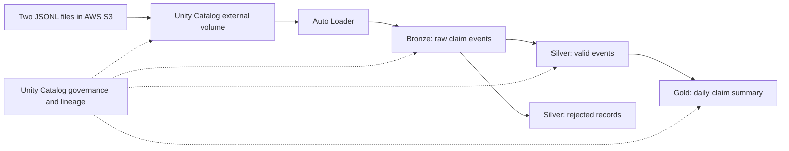

# Insurance Databricks POC on AWS

Status: deployment plan; no resources deployed. Pricing checked October 3, 2026.

## Recommendation and review

For this personal, non-commercial learning POC, start with Databricks Free Edition
and manually upload the two synthetic JSONL files. Use one serverless workspace,
one Unity Catalog catalog, and one manually triggered Lakeflow pipeline (formerly
Delta Live Tables / DLT). Keep the two inputs under 10 KB combined.

Move to a 14-day Databricks on AWS trial when you want to test your own S3/IAM
integration and Terraform deployment. Allow 1–2 days for implementation and testing;
Free Edition costs $0 within quotas. For paid AWS execution, reserve $25–$50 or
use eligible trial credits. The AWS deployment sequence below applies to this
second stage, not to the initial Free Edition exercise.

The original file is a useful Bronze/Silver/Gold sketch, but its orders and sales
example does not match this insurance project. Replace orders with claim-created
events, use decimal currency, validate dates and ownership identifiers, retain
rejected records, and add explicit AWS storage/governance and replay checks.
`import dlt` remains supported; new code should use
`from pyspark import pipelines as dp`, `@dp.table` for streaming tables and
`@dp.materialized_view` for Gold. Incremental materialized-view refresh depends
on query eligibility; it is not guaranteed for every aggregation.
[Python API and DLT migration](https://docs.databricks.com/aws/en/ldp/developer/python-ref).

This POC adds analytics to the intake/employee-review project. The application
remains the system of record for confirmations, reviews and claims actions.
Gold reports estimated losses, not coverage decisions or approved payouts.
Keep the existing four-PDF Bedrock coverage POC and its Phase 1 plan separate.

## Simple medallion architecture



Catalog: `insurance_poc`. Schemas: `landing`, `bronze`, `silver`, `gold`.
Configure current/default pipeline publishing mode and fully qualified table
names for multiple schemas; default pipeline target is `insurance_poc.bronze`.

| Object | Implementation and purpose |
| --- | --- |
| `landing.claim_files` | UC external volume on a dedicated S3 input prefix |
| `bronze.claim_events_raw` | Auto Loader streaming table; original fields, rescued data, source filename, ingestion timestamp |
| `silver.claim_events_valid` | Streaming table; typed fields and quality expectations |
| `silver.claim_events_rejected` | Invalid records with rejection reasons, including rescued fields |
| `gold.daily_claim_summary` | Materialized view; unique claim-created events and total estimate by incident date and LOB |

Use an explicit input schema. Bronze uses `spark.readStream.format('cloudFiles')`
with JSON format; Silver uses streaming table reads; Gold uses batch table reads.
Lakeflow manages checkpoint and schema tracking state. Directory listing is enough
for two files; notification queues/file events are unnecessary for this scope.
[Pipeline ingestion](https://docs.databricks.com/aws/en/ldp/load),
[Unity Catalog pipelines](https://docs.databricks.com/aws/en/ldp/unity-catalog).

## Only two lightweight test files

Use JSONL (newline-delimited JSON): one complete event object per line, without
an enclosing array. Keep Auto Loader’s `cloudFiles.format` set to `json` and
`multiLine` disabled (the default). Each event has `event_id`, `claim_id`, `policy_id`,
`owner_id`, `lob`, `incident_date`, `event_time`, `estimated_loss_usd`, and
`event_type = 'claim_created'`. Use synthetic IDs and no personal/free-text data.
Each unique valid event represents a separate claim; changing estimates/status
updates are outside this POC and would require a current-state/CDC design.

| File | Event | LOB | Incident date | USD estimate | Result |
| --- | --- | --- | --- | --- | --- |
| `claim_events_001.jsonl` | E001 | auto | 2026-10-01 | 1000.00 | Valid |
| 001 | E002 | auto | 2026-10-01 | 500.00 | Valid |
| 001 | E003 | property | 2026-10-01 | 2000.00 | Valid |
| 001 | E004 | auto | 2026-10-01 | -10.00 | Rejected |
| `claim_events_002.jsonl` | E005 | auto | 2026-10-02 | 750.00 | Valid |
| 002 | E006 | property | 2026-10-02 | 1250.00 | Valid |
| 002 | E001 | auto | 2026-10-01 | 1000.00 | Exact duplicate of E001 in file 001 |

Silver requires nonempty IDs, allowed LOB, valid dates/timestamps, correct event
type, nonnegative `decimal(12,2)` estimates and no rescued fields. Handle null
validation predicates as invalid. Use the same validation logic for both valid
and rejected branches and expose expectation metrics.

Auto Loader tracks files, not unique business events. Keep valid duplicate
deliveries in Silver; Gold deduplicates exact event payloads before aggregation
using its batch query. This avoids unbounded streaming deduplication state.
Conflicting payloads for one event ID must fail acceptance; add conflict handling
before widening scope. Silver represents valid deliveries, not unique claims.

## Streaming and acceptance tests

Use triggered mode: process available files, persist incremental state, then stop.
This uses Structured Streaming while keeping compute off between updates. Arrival
latency depends on when the next update runs; it is not an always-on event stream.
[Triggered versus continuous mode](https://docs.databricks.com/aws/en/ldp/concepts/pipeline-mode).

1. Upload only file 001 and run: Bronze 4, Silver valid 3, rejected 1;
   Gold 3 unique claims totaling $3,500.
2. Upload file 002 under its own immutable filename and rerun with the same state:
   Bronze 7, Silver valid 6, rejected 1; Gold 5 unique claims totaling $5,500.
3. Run again without uploads: all counts and Gold totals stay unchanged.
4. Verify Gold groups: Oct 1 auto = 2/$1,500, Oct 1 property = 1/$2,000,
   Oct 2 auto = 1/$750, Oct 2 property = 1/$1,250.
5. Inspect rejected E004, expectations, pipeline graph and UC lineage.

Do not overwrite files, delete checkpoints, or full-refresh during replay tests.
A short continuous-mode demonstration can be added later with an explicit stop
time; continuous execution is unnecessary for the two-file acceptance test.

## Registration and Terraform for a personal POC

Register for Databricks before automating resources. AWS Terraform alone does
not create a Databricks subscription. Signup can be through the Databricks website
or AWS Marketplace. A personal email can be used for the 14-day trial, although
trial compute/network capabilities may be limited.
[Signup requirements](https://docs.databricks.com/aws/en/getting-started/free-trial).

| Path | What to test | Setup approach |
| --- | --- | --- |
| Free Edition: recommended first | Medallion layers, Unity Catalog, Lakeflow/DLT and incremental file streaming with uploaded synthetic files | Register on Databricks; use the provided workspace and UI; no AWS Terraform required |
| 14-day AWS trial: optional second stage | Your own AWS S3/IAM integration plus the pipeline, subject to account permissions | Register through Databricks or AWS Marketplace; then configure AWS and Databricks Terraform providers |

Free Edition provides a managed serverless workspace. It does not deploy classic
compute into your own AWS account, and it has no account-level APIs, classic
compute, or custom workspace storage locations. Do not assume the full AWS
Terraform deployment below is supported in Free Edition.
[Free Edition restrictions](https://docs.databricks.com/aws/en/getting-started/free-edition-limitations).

For the AWS trial, use two Terraform providers with separate authentication:

- **AWS provider:** dedicated S3 bucket, IAM role and policies.
- **Databricks provider:** Unity Catalog objects, pipeline and permissions where
  the trial account allows them. Account-level workspace provisioning requires
  the relevant account access; an existing signup-provided serverless workspace
  is sufficient for this small POC.

Terraform automates authorized resources after signup; it does not replace account
registration or acceptance of subscription terms.
[Databricks Terraform documentation](https://docs.databricks.com/aws/en/dev-tools/terraform/).

Suggested personal learning sequence:

1. Register for Free Edition and use only disposable synthetic data.
2. Upload file 001 to a UC volume, run the pipeline, then upload file 002 and
   perform the incremental/replay checks in this plan. The external S3 volume
   in the AWS architecture is replaced by a managed UC upload volume at this stage.
3. Start the timed AWS trial only when ready to implement S3/IAM integration.
4. Configure both Terraform providers and follow the AWS deployment sequence.
5. Track trial expiry and credits. Marketplace/payment-linked trials can convert
   to paid usage; AWS-owned resources are billed separately from Databricks credits.

## AWS deployment plan

1. Confirm account, operator, region and budget. Prefer the existing project's AWS
   region if serverless pipelines are supported there; use `us-east-1` as the
   planning baseline and verify current regional availability.
2. Start a 14-day trial on AWS, optionally through AWS Marketplace; a personal
   email is allowed, subject to trial restrictions. Confirm
   the serverless workspace has Unity Catalog enabled. Serverless compute runs
   in Databricks-managed AWS infrastructure, not the project's customer VPC.
3. Create one dedicated private S3 bucket with `landing/claim_events/`; block
   public access, require TLS, use SSE-S3 and keep storage in-region. Keep it
   separate from the Bedrock document ingestion prefix.
4. Create the IAM role and trust policy required by UC, including documented
   external ID/self-assumption requirements. Register a storage credential and
   external location, validate access, and create `landing.claim_files`.
   Use scoped read/list permissions for input; grant write/delete only for managed
   storage where needed. Never put access keys in notebooks.
5. Create catalog and schemas. Use available workspace managed storage for Delta
   tables, or configure a separate non-overlapping `managed/` S3 prefix as catalog
   managed storage. External volume and managed-table paths must not overlap.
6. Give the pipeline identity parent usage privileges, `READ VOLUME`,
   `CREATE TABLE` on Bronze/Silver and `CREATE MATERIALIZED VIEW` on Gold.
   Admin creates storage objects. Analytics readers receive Gold `SELECT` and
   parent usage only. Verify they cannot read raw/Silver/landing data.
   Customer-level row isolation is a future requirement, not demonstrated here.
7. Add one Python pipeline source defining all datasets. Choose serverless,
   triggered execution, current publishing mode and expectations support.
   If an edition selector is shown, select an edition supporting expectations.
   Keep schedules disabled; upload fixtures sequentially and run the tests above.
8. Query Gold in short notebook/SQL sessions and stop compute afterward. Save
   run IDs, region, counts, quality/permission evidence, lineage and actual usage.
9. Stop schedules/compute after the demo; remove dedicated POC UC/storage/IAM
   resources when finished and verify remaining billing. Preserve app/Bedrock data.

For repeatability, implement a separate Terraform root such as
`infra/aws/terraform/databricks_poc`, with AWS and Databricks providers. This file
plans that work; no Terraform implementation or deployment is claimed.
If compute must run in your own VPC, plan a classic workspace separately with
network/workspace infrastructure and additional cost.
[UC S3 setup](https://docs.databricks.com/aws/en/connect/unity-catalog/cloud-storage/s3).

## Free options and low-budget estimate

| Option | Fit | Cost |
| --- | --- | --- |
| Free Edition | Personal non-commercial learning; manually uploaded synthetic files, limited serverless usage | $0 within quotas; recommended for the initial personal learning exercise |
| 14-day AWS trial (personal email allowed) | Optional second stage for actual S3/UC integration, subject to trial restrictions | Up to $400 Databricks credits valid 14 days; confirm eligibility; AWS charges remain separate |
| Paid AWS serverless | On-demand short POC after trial or without credits | Reserve $25–$50, subject to measured consumption |

Free Edition has one workspace/metastore, no classic compute or custom workspace
storage locations, restricted network/admin features and one active pipeline per
pipeline type. It is for non-commercial use; Databricks states it may train on
Free Edition data. Use disposable synthetic data for personal learning.
[Free/trial comparison](https://docs.databricks.com/aws/en/getting-started/free-trial-vs-free-edition),
[Free Edition restrictions](https://docs.databricks.com/aws/en/getting-started/free-edition-limitations).

A Marketplace/payment-linked trial can convert to pay-as-you-go when credits are
exhausted. Track expiry and follow cancellation steps if ending the experiment.
[Trial and cancellation](https://docs.databricks.com/aws/en/getting-started/free-trial).

The following is a planning estimate, **not a verified regional SKU quote**.
The fetched public pricing page did not expose a usable serverless regional rate.
Obtain it from the [Databricks pricing page/calculator](https://www.databricks.com/product/pricing)
and substitute it for P before provisioning:

```text
Pipeline spend = billed pipeline DBUs × price per DBU (P)
Assumption: 6 updates × 10 minutes × 10–20 DBU/hour = 10–20 DBUs
Sensitivity assumption P = $0.50–$1.00/DBU: $5–$20 pipeline spend
Query/debug allowance: $5–$15
Storage/request contingency: $1–$5
Illustrative total: $11–$40; practical budget reserve: $25–$50
```

Runtime, DBU/hour and P are assumptions, not vendor guarantees or configured
minimums. Measure the first run and revise the estimate. Serverless includes
managed compute; do not add separate EC2 charges for the same execution. Include
separately billed storage/connectivity. Classic compute adds EC2/EBS/network cost.
Tiny inputs do not remove startup, retries, checkpoint, Delta storage or query costs.
Check regional [S3 pricing](https://aws.amazon.com/s3/pricing/).
This budget excludes existing RDS, Bedrock and insurance application hosting.

Use manual updates, no overnight continuous pipeline, brief query sessions,
same-region storage and no dedicated classic cluster/NAT gateway for this design.
Set AWS/Databricks alerts at $10/$25/$50; alerts are not hard spending caps.
Review usage after the first update and stop further runs if projected cost exceeds
$50. Databricks trial credits do not automatically pay AWS-owned resource charges.

## Done criteria

Two-file incremental/replay checks pass; rejects remain inspectable; Gold totals
match; reader permissions and lineage are verified; actual deployment and cost
evidence is recorded. No Kafka/Kinesis, PDF extraction, RAG integration, claims
writes, dashboard deployment, CDC or production continuous scheduling is required.
